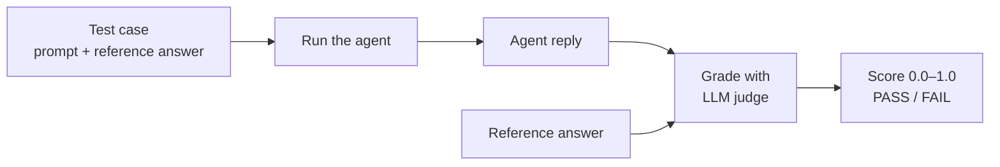
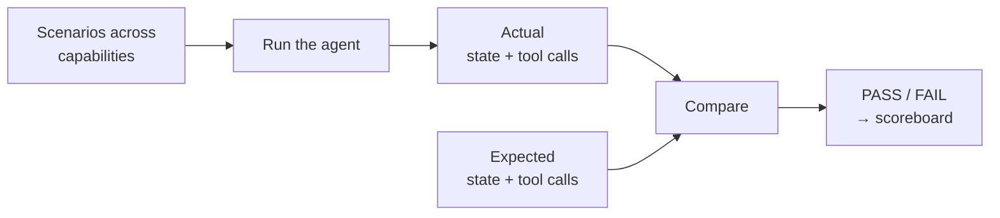

# Foundry Agent Evals

Agent Evals is a Python library for iterating on AI agents with confidence. Use it to:

- **Catch regressions with evals** — when a failure mode shows up, fix it, and assert with a test that it doesn't come back. Wire those tests into CI as a quality gate.
- **Measure breadth with benchmarks** — score your agent across all the capabilities it should handle, then re-run after prompt changes, model swaps, or fine-tuning to validate agent behavior.
- **Works with any Python agent** — OpenAI Agents, LangChain, Strands, or your own custom code; if it's a Python agent, you can evaluate it.

At a glance — an eval grades the agent's answers against an expected response:

| Ask | Agent's answer | Eval |
|---|---|---|
| Which rooms have lights on? | All lights are off. | ✅ 1.00 |
| Is the house secure? | Doors are unlocked, so not secure. | ❌ 0.60 |
| Is it dark in here? | All lights off, so it's dark. | ❌ 0.60 |

---

## Install

Requires Python 3.14+ and [uv](https://docs.astral.sh/uv/).

In your consumer repo, initialize with Python 3.14:

```bash
uv init --python 3.14
```

Install as a dev dependency (evals are test-time infrastructure, not runtime code):

```bash
uv add --dev "agent-evals @ git+https://github.com/boozallen/agent-evals"
```

Or pinned to a specific release:

```bash
uv add --dev "agent-evals @ git+https://github.com/boozallen/agent-evals@v1.0.0"
```

**Optional extras**: `braintrust`, `langchain`, and `strands` — each pulls in that framework's SDK so the corresponding adapter or converter can be used.

```bash
uv add --dev "agent-evals[braintrust] @ git+https://github.com/boozallen/agent-evals"
uv add --dev "agent-evals[strands] @ git+https://github.com/boozallen/agent-evals"
```

---

## Example Agent We'll Evaluate

Both quickstarts below use the same example home automation agent — a Strands home-automation assistant with three tools (set lights, lock doors, read state) and an in-memory home state. We define it once here, then drive it two different ways: as an eval (regression test for one failure mode) and as a benchmark (capability scoreboard across scenarios).

**Prereq:** This example uses [Ollama](https://ollama.ai) running `gpt-oss:20b` and the Strands Agent SDK.

```bash
# Pull model
ollama pull gpt-oss:20b
# Install Strands dependencies
uv add --dev 'agent-evals[strands]'
uv add 'strands-agents[openai]'
```

Next we'll create our example home automation agent inspired by this [Liquid AI example](https://docs.liquid.ai/examples/customize-models/home-assistant). Save as `home_agent.py` in your project root:

```python
from typing import Literal

from agent_evals import BaseAgent, TaskResult
from agent_evals.adapters.converters.strands import strands_to_openai
from strands import Agent, tool
from strands.models.openai import OpenAIModel


SYSTEM_PROMPT = """\
You are a home-automation assistant. Use tools to change or read device state.
Lights (on/off): kitchen, bedroom, living_room. Doors (lock/unlock): front, back.
Use the minimum tool calls needed. After a tool succeeds, do NOT verify; reply briefly.
For status queries, call get_device_status ONCE then reply in text.
"""


def _default_home_state() -> dict:
    return {
        "lights": {r: {"state": "off"} for r in ("kitchen", "bedroom", "living_room")},
        "doors": {"front": "unlocked", "back": "unlocked"},
    }


class HomeAgent(BaseAgent):
    name = "home"
    version = "0.1.0"

    async def setup(self) -> None:
        # Build expensive shared state ONCE before the run starts.
        # Models, HTTP clients, DB connections -- anything you don't want
        # to recreate per scenario goes here.
        self._model = OpenAIModel(
            client_args={"base_url": "http://localhost:11434/v1", "api_key": "not-needed"},
            model_id="gpt-oss:20b",
            params={"temperature": 0},
        )

    async def teardown(self) -> None:
        # Release and cleanup anything setup() acquired
        # Runs once after every scenario has finished
        pass

    def _build_tools(self, home_state: dict):
        @tool
        def set_light(room: str, state: Literal["on", "off"]) -> str:
            """Set a room's light to on or off."""
            if room not in home_state["lights"]:
                return f"Unknown room: {room}"
            home_state["lights"][room]["state"] = state
            return f"light.{room}={state}"

        @tool
        def lock_door(door: str, locked: bool) -> str:
            """Lock or unlock a door."""
            if door not in home_state["doors"]:
                return f"Unknown door: {door}"
            home_state["doors"][door] = "locked" if locked else "unlocked"
            return f"door.{door}={home_state['doors'][door]}"

        @tool
        def get_device_status(device_type: Literal["lights", "doors", "all"]) -> dict:
            """Read current device state. Use for status queries."""
            if device_type == "all":
                return home_state
            return home_state.get(device_type, {})

        return [set_light, lock_door, get_device_status]

    async def run_case(self, prompt: str, **kwargs) -> TaskResult:
        # Per-call home state: each scenario gets its own dict so
        # concurrent scenarios can't leak state into one another.
        home_state = _default_home_state()
        agent = Agent(model=self._model, tools=self._build_tools(home_state), system_prompt=SYSTEM_PROMPT)
        await agent.invoke_async(prompt)
        return TaskResult.from_messages(
            strands_to_openai(agent.messages),
            final_state=home_state,
            # Factuality (and other LLM judges) interpolate {{input}} from context.
            input=prompt,
        )
```

`BaseAgent` gives us three lifecycle methods:

- **`setup`** — runs once before any scenario. Build the model client.
- **`run_case`** — runs once per scenario. Execute the agent against a prompt.
- **`teardown`** — runs once after the last scenario. Release whatever `setup` acquired.

---

## Eval Quickstart

**An eval is a regression test for a specific failure mode.** Here we evaluate whether `HomeAgent` can read its home state and answer truthfully — three status questions of increasing indirectness, each paired with the answer a correct agent should give. Add more files to grow your regression suite.

Prerequisites for this example:

```bash
uv add openai
```

Local platform runs encrypt eval and benchmark artifacts at rest. Set
`FOUNDRY_EVALS_ENCRYPTION_KEY` (64-character hex string, 32 bytes) before the
first `run_eval` / `run_benchmark` call:

```bash
# Generate a key
uv run python -c "import os; print(os.urandom(32).hex())"

# Export it for this shell
export FOUNDRY_EVALS_ENCRYPTION_KEY="<your-64-char-hex-key>"
```

Or as a one-liner:

```bash
export FOUNDRY_EVALS_ENCRYPTION_KEY="$(uv run python -c 'import os; print(os.urandom(32).hex())')"
```

You also need your own agent module (`home_agent` below). Replace it with your agent's import.

We'll put evals in a top-level `evaluations/` directory and name each file after what it's checking. Over time the directory grows into your agent's regression suite — each file checks one capability or failure mode.

Save it as `evaluations/home_state_reasoning.py`:

```python
import asyncio

import openai

from agent_evals import ExampleData, ExpectedResult, run_eval_async
from agent_evals.adapters.scorers.autoevals import Factuality
from home_agent import HomeAgent

# Point the LLM-as-judge at the local Ollama.
# Swap base_url / model_id / api_key for any other OpenAI-compatible endpoint.
# This base_url is on a client you construct and inject, so it is yours to
# secure -- agent-evals validates only the endpoint values it resolves itself
# (a base_url= passed directly to a scorer factory is checked against the
# allowlist; see the transport-security section of docs/foundry/guides/platforms.md).
_judge = openai.AsyncOpenAI(base_url="http://localhost:11434/v1", api_key="not-needed")


async def main() -> None:
    test_cases = [
        # Direct: read state and report it.
        ExampleData(
            input="Which rooms have lights on?",
            expected=ExpectedResult(expected="None of the rooms have lights on."),
        ),
        # Moderate: map "secure" -> door-lock state, then report.
        ExampleData(
            input="Is the house secure?",
            expected=ExpectedResult(expected="No, neither of the doors are locked."),
        ),
        # Indirect: map "dark" -> lights state, then connect.
        ExampleData(
            input="Is it dark in here?",
            expected=ExpectedResult(expected="Yes, all of the lights are turned off."),
        ),
    ]

    agent = HomeAgent()
    await agent.setup()
    try:
        result = await run_eval_async(
            # run_eval_async accepts any async callable; pass the bound
            # method directly. (BaseAgent.run_case takes optional **kwargs
            # we don't need here.)
            task=agent.run_case,
            dataset=test_cases,
            scorers=[Factuality(client=_judge, model="gpt-oss:20b")],
        )
    finally:
        await agent.teardown()

    print("\nFactuality Results")
    print("-" * 40)
    for i, ex in enumerate(result.examples, 1):
        score = ex.scores["Factuality"]
        status = "PASS" if score.passed else "FAIL"
        print(f"\nCase {i}: {score.value:.2f} [{status}]")
        print(f"  Input:    {ex.input}")
        print(f"  Output:   {ex.output}")
        print(f"  Expected: {ex.expected}")


if __name__ == "__main__":
    asyncio.run(main())
```

Run it from your project root (with `FOUNDRY_EVALS_ENCRYPTION_KEY` still set in
this shell):

```bash
uv run python -m evaluations.home_state_reasoning
```

Output:

```
Factuality Results
----------------------------------------

Case 1: 1.00 [PASS]
  Input:    Which rooms have lights on?
  Output:   All lights are currently off.
  Expected: None of the rooms have lights on.

Case 2: 0.60 [FAIL]
  Input:    Is the house secure?
  Output:   The front and back doors are currently unlocked, so the house is not secure.
  Expected: No, neither of the doors are locked.

Case 3: 0.60 [FAIL]
  Input:    Is it dark in here?
  Output:   All lights are off, so it is dark.
  Expected: Yes, all of the lights are turned off.
```

**What just happened:** each case follows the same path:



Factuality returns a 0.0–1.0 score and marks each case PASS or FAIL based on its `threshold` (0.7 by default; pass `threshold=...` to change it).

**Project layout:**

```
your-project/
├── pyproject.toml
├── home_agent.py
└── evaluations/
    ├── __init__.py
    └── home_state_reasoning.py
```

Drop more eval files alongside `home_state_reasoning.py` and run each with `python -m evaluations.<filename>`.

---

## Benchmark Quickstart

**A benchmark measures and tracks capability across many scenarios at once.** Here we score the same `HomeAgent` across four capabilities — lights, doors, secure-house, status — using state checks, tool-call checks, and both combined.

Next, we describe what the agent should be able to do. Instead of writing each test in Python like we did with evals, we declare them in YAML — grouped into capabilities so the scoreboard at the end shows where the agent is strong and where it's weak. Save it as `benchmarks/home-config.yaml`:

```yaml
benchmark: home-automation
description: Tiny home-automation benchmark

# Where results go. `local` writes to the filesystem. To send results to
# an observability platform (Braintrust, MLflow, LangFuse) for tracking,
# see docs/foundry/guides/platforms.md.
platform:
  name: local
  experiment: v1

execution:
  # How many times each scenario runs.
  runs_per_scenario: 1
  # How many runs execute in parallel.
  n_parallel_runs: 2

# Each capability groups scenarios that check one thing about the agent.
capabilities:
  # Check the result: did the lights end up in the right state?
  - name: lights
    scenarios:
      - id: 1
        name: kitchen on
        prompt: Turn on the kitchen light
        success:
          state:
            lights.kitchen.state: "on"

  # Check the action: did the agent call the right tool to lock the door?
  - name: doors
    scenarios:
      - id: 2
        name: lock front
        prompt: Lock the front door
        success:
          tool_use:
            match_args: superset
            calls:
              - name: lock_door
                args:
                  door: front
                  locked: true

  # Check both: the right action AND the right result to secure the house.
  - name: secure-house
    scenarios:
      - id: 3
        name: lock back via tool + state
        prompt: Lock the back door
        success:
          tool_use:
            match_args: superset
            calls:
              - name: lock_door
                args:
                  door: back
                  locked: true
          state:
            doors.back: "locked"

  # Check the action exactly: did the agent query status with no extra calls?
  - name: status
    scenarios:
      - id: 4
        name: lights status (exact args)
        prompt: Are any lights on?
        success:
          tool_use:
            match_args: exact
            calls:
              - name: get_device_status
                args:
                  device_type: lights
      - id: 5
        name: doors status (exact args)
        prompt: Which doors are unlocked?
        success:
          tool_use:
            match_args: exact
            calls:
              - name: get_device_status
                args:
                  device_type: doors
```

Now run it. A single `run_benchmark_async` call ties the YAML and the agent together and hands back a `BenchmarkResult` you can print and save. Save it as `benchmarks/run.py`:

```python
import asyncio

from agent_evals import run_benchmark_async

from home_agent import HomeAgent


async def main():
    result = await run_benchmark_async("benchmarks/home-config.yaml", agent=HomeAgent)
    print(result.to_markdown())                        # display the report
    path = result.write_report("benchmarks/results")   # save a local copy
    print(f"Report written to {path}")


if __name__ == "__main__":
    asyncio.run(main())
```

**Project layout** (now with both the eval and the benchmark):

```
your-project/
├── pyproject.toml
├── home_agent.py
├── evaluations/
│   ├── __init__.py
│   └── home_state_reasoning.py
└── benchmarks/
    ├── __init__.py
    ├── home-config.yaml
    └── run.py
```

Run it from your project root (same `FOUNDRY_EVALS_ENCRYPTION_KEY` as the eval
quickstart — local benchmarks encrypt artifacts too):

```bash
uv run python -m benchmarks.run
```

You'll get a scoreboard: an overall pass rate, a breakdown per capability, and every scenario's result. The same report is saved to `benchmarks/results/<timestamp>_home-automation.md`.

```
# Benchmark: home-automation

## Score

4/5 (80%)

## Breakdown

### By capability

- `doors` — 100% (1/1 examples)
- `lights` — 100% (1/1 examples)
- `secure-house` — 100% (1/1 examples)
- `status` — 50% (1/2 examples)

## Tasks

### doors

#  Name        Result  Time
-  ----------  ------  ----
2  lock front  PASS    1.3s

### lights

#  Name        Result  Time
-  ----------  ------  ----
1  kitchen on  PASS    1.7s

### secure-house

#  Name                        Result  Time
-  --------------------------  ------  ----
3  lock back via tool + state  PASS    1.2s

### status

#  Name                        Result  Time
-  --------------------------  ------  ----
4  lights status (exact args)  PASS    2.6s
5  doors status (exact args)   FAIL    4.8s
```

**What just happened:** same path as an eval, but it runs across every scenario in every capability, and instead of judging the agent's reply it compares what the agent *did* — the resulting state and tool calls — against what it was expected to do:



**A real failure surfaced.** Scenario 5 asked "Which doors are unlocked?" with strict matching on the tool call. The agent looked up doors *and* lights — that's an extra tool call the spec doesn't allow. The fix is on the agent side:

- **Sanity-check against a SOTA model** — if a frontier model also fails, the prompt is wrong; if it passes, the issue is model capability and the fixes below apply to the model you actually want to ship.
- **Tighten the system prompt** so the model only checks what was asked.
- **Refine the tools** (e.g., split `get_device_status` so the model can't ambiguously over-fetch).
- **Fine-tune** if prompt + tool changes don't get you there.

> When you swap models, prompts, or tools, it's advisable to run the benchmark multiple times and diff the per-capability scores. Single-run snapshots are noisy; deltas are signal.

---

## Eval or benchmark — which do I reach for?

They share the same agent and the same scorers; pick by the question you're asking.

**Use an eval when:**

- A specific failure mode showed up, you fixed it, and you want to assert it doesn't come back.
- You want a quality gate in CI/CD that fails the build on regression.
- You're driving a focused test from Python and want per-case scores you can act on.

**Use a benchmark when:**

- You want broad coverage across the capabilities your agent should handle (status queries, tool use, edge cases, refusals, the whole surface).
- You're iterating on a change — fine-tuning a model, rewriting the system prompt, adding a tool — and want a before/after read on every capability at once.
- You'd rather declare tests in YAML than write a runner in Python.

Most teams end up doing both.

---

## Local Development & Verification

Contributors run lint, type checks, and tests locally before opening a pull
request. Everything resolves from public PyPI — no additional registry access
is required.

```bash
# One-time setup: install all dependencies and the pre-commit hooks
just setup

# Lint, format, type check, and test in one pass
just check
```

The individual steps, if you want to run them separately:

```bash
just lint          # ruff check
just format        # ruff format --check
just type-check    # ty
just lint-imports  # import-linter layer contracts
just test          # full pytest suite with coverage
```

Coverage is always on, and its gate is a whole-tree number — pass `--no-cov` to
any run narrower than the whole tree. The `just test-integration` and
`just test-validation` recipes already handle this for you.

Pre-commit runs the same checks on staged files:

```bash
uv run pre-commit run --all-files
```

### Build & Verify

Build the wheel and verify it installs outside the source tree:

```bash
uv build
```

```bash
uv venv /tmp/ae-verify --python 3.14
uv pip install --python /tmp/ae-verify/bin/python \
  dist/agent_evals-*.whl
/tmp/ae-verify/bin/python -c \
  "import agent_evals; print(agent_evals.__version__)"
```

---

## Next steps

- [Benchmarks](docs/foundry/guides/benchmarks.md) — documentation on agent benchmarks
- [Platforms](docs/foundry/guides/platforms.md) — configure an observability platform (Braintrust, MLflow, LangFuse) to track experiments over time
- [Scorers](docs/foundry/guides/scorers.md) — grade text answers, semantic similarity, valid JSON, factuality, or judge tone and quality with an LLM
- [Contributing](CONTRIBUTING.md) — Developer documentation for contributors

---
