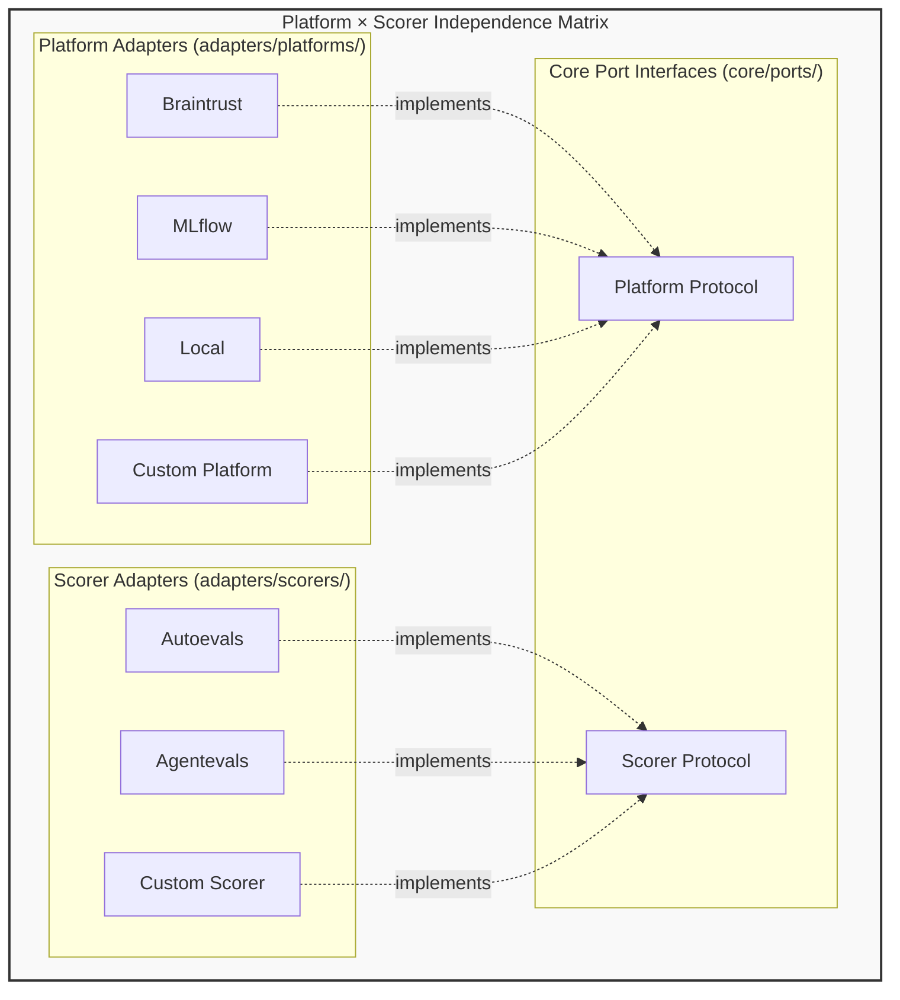

# Adapter Architecture - Independence and Extensibility

## Innovation

**Platform adapters and scorer adapters are fully independent and extensible, enabling any platform to work with any scorer combination without vendor lock-in, while allowing third parties to add custom adapters without modifying core code.**

Traditional evaluation frameworks tightly couple agent code to specific platforms and scorers, making it difficult to switch platforms or change scorer combinations without rewriting integration code. Our innovation decouples these concerns completely while providing stable plugin interfaces. Platform Adapters orchestrate evaluation execution and manage results, Scorer Adapters control how to evaluate outputs. Write your agent evaluation once, run on any platform with any scorer combination. Extend with custom adapters without touching core code.

## Adapter Plugin Architecture

**Folder Structure:**
- Port interfaces defined in `core/ports/` (Platform, Scorer protocols)
- Platform adapters in `adapters/platforms/` (Braintrust, MLflow, LangFuse, Local)
- Scorer adapters in `adapters/scorers/` (Autoevals, Agentevals)
- Composition Root in top-level `__init__.py` wires adapters to core



## Adapter Independence

### Platform-Scorer Decoupling

Platform adapters and scorer adapters can be mixed and matched independently:
- **Platform Layer**: Orchestrate evaluation execution and controls where results go (Braintrust, MLflow, LangFuse, Local, Custom)
- **Scorer Layer**: Define scoring logic and evaluation criteria (Autoevals, Agentevals, Custom)

### Key Benefits

**Zero Vendor Lock-in**
- Switch platforms without rewriting integration code
- Move from Braintrust → MLflow → LangFuse → Local → Custom without changing scorers
- Experiment with different platforms

**Scorer Portability**
- Write scorers once, use on any platform
- Mix scorer libraries (Autoevals + Agentevals + Custom)
- Add new scorers without platform changes (DeepEval, etc)

## Plugin Extensibility

### Custom Adapter Integration

Extend the system by implementing adapter interfaces:

**Custom Platform Adapters:**
- Additional evaluation platforms (Arize, Confident AI, LangFuse, etc.)
- Internal evaluation infrastructure
- Legacy system integration

**Custom Scorers:**
- Domain-specific validation (medical, legal, financial)
- Business logic validation
- Proprietary scorers

### Extension Benefits

**For Organizations and Plugin Developers:**
```
Progressive Adoption:
  ✓ Start with built-in adapters
  ✓ Add custom adapters as needed
  ✓ No big-bang migration required

Stable Interface:
  ✓ Interface won't break with core updates
  ✓ Backward compatibility guaranteed
  ✓ Clear contract to implement

Automatic Integration:
  ✓ No core modifications needed
  ✓ Works with all existing components
  ✓ Future-proof implementation
```

## Combination Examples

### Same Scorers, Different Platforms

**Scenario:** Team wants to try different platforms without changing Scorers (evaluation logic)

```
Evaluation Configuration:
  Test Cases: [Same test cases]
  Scorers: [Exact Match, Factuality, Trajectory Match]

  Platform Option 1: Braintrust
  Platform Option 2: MLflow
  Platform Option 3: Local

Result: Same scorers and test cases, each platform orchestrates execution
Benefit: Zero vendor lock-in, easy platform experimentation
```

### Same Platform, Different Scorers

**Scenario:** Team wants to add new scorers without platform changes

```
Evaluation Configuration:
  Test Cases: [Same test cases]
  Platform: Braintrust

  Week 1 Scorers: [Exact Match]
  Week 2 Scorers: [Exact Match, Factuality]
  Week 3 Scorers: [Exact Match, Factuality, Trajectory Match]
  Week 4 Scorers: [Exact Match, Factuality, Trajectory Match, Custom Compliance Checker]

Result: Progressive scorer addition without platform changes
Benefit: Evaluation sophistication grows over time
```
