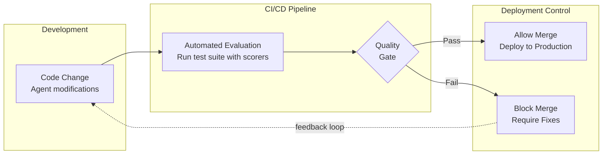

# CI/CD Integration - Automated Regression Testing

## Innovation

**Continuous evaluation in CI/CD pipelines catches agent misalignments before production deployment, preventing "whack-a-mole" regression problems in agent development.**

Traditional agent development lacks automated quality gates - changes that fix one problem often introduce new issues. Our innovation enables automated regression testing in CI/CD pipelines (GitHub Actions, etc.), catching behavioral regressions before they reach production and enabling systematic quality control.

## CI/CD Evaluation Workflow



## Preventing "Whack-a-Mole" Problems

### The "Whack-a-Mole" Problem in Agent Development

**Common Scenario:**
```
Week 1: Agent fails on edge case A
  → Fix edge case A
  → Deploy to production

Week 2: Fix for A breaks previously working case B
  → Fix case B
  → Deploy to production

Week 3: Fix for B breaks previously working case C
  → Fix case C
  → Deploy to production

Problem: Fixing one issue introduces new regressions
Root Cause: No systematic regression testing
Solution: Automated agent regression testing
```
