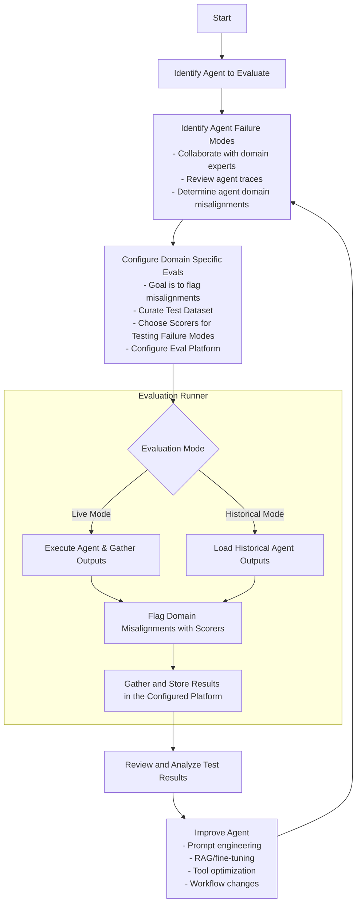

# Agent Evaluation Lifecycle

## Overview

**A comprehensive guide to evaluating AI agents from initial setup through continuous improvement.**

This document outlines the complete workflow for evaluating AI agents, covering everything from initial configuration to iterative improvement. The framework supports both live agent execution and historical trace evaluation. Historical mode is particularly valuable for evaluating real production data—analyzing how your agent actually performs with real users, then building scorers to catch the misalignments domain experts identify in those traces.

The evaluation lifecycle provides a structured approach to identify domain misalignments, implement targeted improvements, and track progress over time. Whether you're testing new agent prompts, analyzing production traces, or comparing different approaches, this workflow guides you through each step of the process.

## End-to-End Evaluation Workflow

## Workflow Components

### 1. Identify Agent Failure Modes

The evaluation workflow begins by identifying the agent you want to evaluate. This can be any AI system: LLM-based chatbots, reasoning systems, tool-using agents, or multi-step workflows.

Once you have your agent, the next critical step is to identify failure modes by **reviewing agent traces with domain experts**. This is not about hypothesizing what might go wrong—it's about examining real agent behavior and having domain experts flag where the agent's responses don't meet their standards.

#### Review Agent Traces with Domain Experts

Engineers alone cannot effectively identify all failure modes. Domain experts understand the nuances, terminology, and quality standards that matter in their field. The process is:

1. **Collect agent traces**: Gather real outputs from production or test runs
2. **Review traces together**: Walk through agent responses with domain experts
3. **Identify domain misalignments**: Domain experts flag responses that are incorrect, incomplete, use wrong terminology, miss important context, or otherwise fail to meet requirements
4. **Document specific failure modes**: Capture concrete examples of what went wrong and why it matters
5. **Prioritize**: Not all failures are equal—domain experts help rank which issues are most critical to address

#### This Is a Continuous Process

Failure mode identification is not a one-time activity. As [Hamel Husain observes](https://hamel.dev/blog/posts/evals/index.html), teams should "continuously update [tests] based on new failures observed in the data as users challenge the AI."

Plan to revisit this process regularly:
- When the agent is updated (new prompts, models, or tools)
- When new production traces reveal unexpected issues
- When domain requirements evolve
- After each improvement cycle to verify fixes and discover new edge cases

### 2. Configure Domain-Specific Evals

After identifying failure modes with domain experts, the next step is to build evaluations that **flag domain misalignments**. This is not about generic "performance testing"—it's about creating domain-specific checks that catch the exact issues your experts identified.

#### Curate Test Dataset with Domain Experts

Work with domain experts to build a test dataset directly from the failure modes you identified:

- **Use real traces as test cases**: The traces where domain experts flagged issues become your test cases
- **Inputs that triggered failures**: Questions or scenarios that exposed domain misalignments
- **Expected outputs from experts**: Domain experts provide what the correct response should have been
- **Metadata for categorization**: Tag each test case with the failure mode it targets

The dataset should directly target the specific misalignments your domain experts identified—not hypothetical edge cases.

#### Write Scorers to Flag Domain Misalignments

Scorers are not generic quality metrics (Helpfulness, Faithfulness, etc.). Generic scores are hard to act on — how do you improve from a 3.5 helpfulness score? Each scorer should be designed to flag a specific domain misalignment so you know exactly what to fix:

**Domain-Specific Scorers (work with experts to define these):**
- **Terminology checker**: Flag when the agent uses incorrect domain terminology
- **Completeness checker**: Flag when the agent omits information domain experts deem essential
- **Factual alignment**: Verify agent claims against domain-specific ground truth
- **Workflow compliance**: Ensure agent follows domain-required processes or steps

**Scorer Design Principles:**
- Each identified failure mode should map to at least one scorer
- Scorers should be specific enough that when they fail, you know exactly what's wrong
- Domain experts should validate that scorers catch the issues they care about
- Start simple—a regex or rule-based check is often better than a complex LLM judge

**Sources for Scorers:**
- **Custom scorers**: Write domain-specific logic based on expert input (preferred)
- **LLM-as-judge**: Use a model to evaluate alignment, but align the judge with your domain expert's criteria
- **Built-in scorers**: Use pre-implemented metrics where they genuinely match your domain needs
- **External libraries**: Integrate scorers from libraries like AutoEvals where appropriate

#### Configure Eval Platform

Choose and configure your evaluation platform:

- **Local storage**: Save results to local files for quick iteration during development
- **External adapters**: Integrate with platforms like Braintrust, MLflow, or other experiment tracking systems for team collaboration and historical comparison

### 3. Evaluation Execution

The evaluation runner orchestrates the process:

1. **Configuration**: Load agent, dataset, scorers, and platform settings
2. **Mode Selection**: Choose between live agent execution or historical evaluation.
   - **Live Mode**: Execute the agent on test inputs to generate fresh outputs.  Useful for testing changes before deployment (local development or CI/CD)
   - **Historical Mode**: Evaluate real production traces from actual user interactions.  Useful for identifying how your agent performs with real users
3. **Scoring**: Apply scorers to flag domain misalignments in agent outputs
4. **Results Storage**: Gather and store results in the configured platform
   - **Test Case Traces**: Individual test case executions are sent to the configured platform, containing detailed scorer grades for each evaluation metric
   - **Experiment Summary**: Aggregate dataset-level metrics are computed and stored, providing overall statistics across all test cases
5. **Error Handling**: Manage failures gracefully and provide diagnostics

### 4. Improve the Agent

After evaluation completes, you have concrete data on which misalignments your scorers flagged. Now you can take targeted action—**with confidence**.

Without evals, improving an agent is a game of whack-a-mole: fix one issue, introduce a regression elsewhere. With your domain-specific scorers in place, you can modify prompts, update RAG, or change workflows knowing that your existing evals will catch regressions. Your past test cases become a safety net that lets you iterate quickly without worrying about breaking what already works.

- **Prompt engineering**: Refine instructions, add examples, clarify edge cases
- **RAG improvements**: Better retrieval, improved context selection, updated knowledge base
- **Fine-tuning**: Train on corrected examples for syntax, style, or domain-specific rules
- **Tool optimization**: Fix tool descriptions, parameter handling, or available functions
- **Workflow changes**: Restructure agent logic, add validation steps, adjust routing

#### Continuous Improvement

After implementing changes, return to reviewing traces with domain experts. Verify your fixes actually work, identify any new misalignments your changes may have introduced, and discover edge cases you hadn't considered. Each cycle through the loop makes your agent more aligned with domain requirements—and your eval suite more comprehensive. This is not a one-time process; the best agents are continuously improved based on real production feedback.

### 5. Platform Integration

When you're ready, evaluation platforms can provide:

- **Experiment Tracking**: Store and organize evaluation runs
- **Metric Visualization**: Charts and dashboards for result analysis
- **Historical Comparison**: Track alignment trends over time
- **Team Collaboration**: Share results and insights with domain experts
- **Automated Reporting**: Generate summaries and alerts
