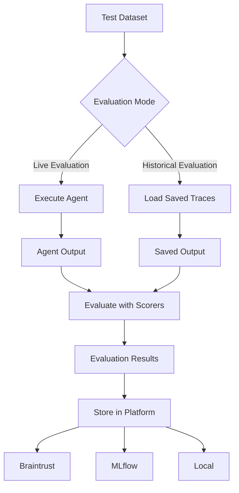

# Evaluation Modes - Historical vs Live Evaluation

## Innovation

**Dual evaluation modes provide unified interface for both executing agents (Live) and evaluating saved traces (Historical), enabling flexible evaluation workflows.**

Our innovation provides two evaluation modes through a unified interface: Live mode executes agents and evaluates their output, Historical mode evaluates saved traces without execution. Both modes use the same evaluation framework, scorers, and result format, enabling teams to choose the appropriate mode for each scenario: live execution when fresh results are needed, historical evaluation for cost-effective scoring of saved traces and production monitoring.

## Evaluation Modes Overview

