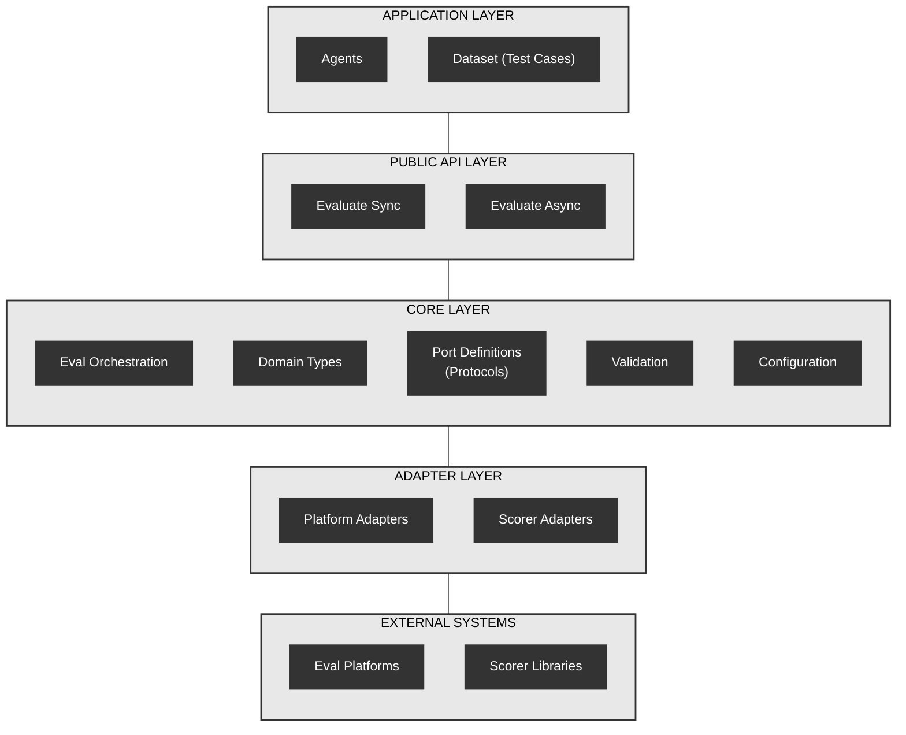
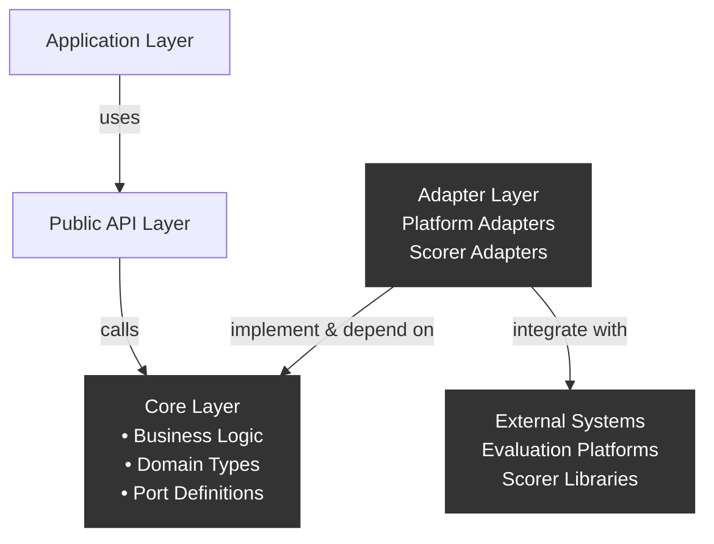

# System Architecture - Hexagonal Design

This document shows the hexagonal architecture through two complementary views: component organization within layers, and dependency relationships between those components.

## Layer Organization

**Shows:** What components exist in each architectural layer and how layers are structured.

**Purpose:** Understand the system's organizational structure and component placement.



## Layer Descriptions

### Application Layer
**Consumer code using the framework**
- **Agents**: User's agent implementations
- **Dataset**: Test cases for evaluation

### Public API Layer
**Entry points for evaluation**
- **Evaluate Sync**: Synchronous evaluation interface
- **Evaluate Async**: Asynchronous evaluation interface

### Core Layer
**Business logic and interface definitions - platform and scorer agnostic**
- **Eval Orchestration**: Coordinates evaluation workflow
- **Domain Types**: Core data models (Score, EvalResult, ExampleData)
- **Port Definitions**: Protocol interfaces (Platform, Scorer)
- **Validation**: Input validation and error handling
- **Configuration**: Execution configuration

**Note**: Ports are INSIDE the Core layer - Core owns and defines all interface contracts

### Adapter Layer
**Implementations connecting to external systems**
- **Platform Adapters**: Braintrust, MLflow, LangFuse, Local, Custom
- **Scorer Adapters**: Autoevals, Agentevals, Custom

### External Systems
**Third-party platforms and libraries**
- **Eval Platforms**: External evaluation services such as Braintrust, MLflow, and LangFuse
- **Scorer Libraries**: External scoring implementations such as Autoevals and Agentevals

## Dependency Relationships

**Shows:** How components depend on each other and the direction of those dependencies.

**Purpose:** Understand dependency inversion - the core principle of hexagonal architecture.

The architecture follows strict dependency inversion where all dependencies point inward toward abstractions. Core defines the port interfaces it needs, and adapters implement those interfaces without Core ever depending on adapter implementations.



**Key:** Arrows show dependency direction - Adapters depend on Core's port interfaces

**Dependency Rules:**

```
✅ Adapters → Core (depends on)     Adapters depend on Core's port interfaces and types
✅ Adapters → External (integrates) Adapters integrate with external systems
❌ Core → Adapters (FORBIDDEN)      Core never imports from adapters
```

**Within Core (internal):**
- Core defines port interfaces (Protocols) in `core/ports/`
- Core uses its own port interfaces for orchestration
- Ports have no external dependencies (pure interfaces)

**Key Principles:**

- **Core Defines Ports**: Core owns all Protocol interfaces (in `core/ports/`)
- **Dependency Inversion**: Dependencies point inward to abstractions, not implementations
- **Isolation**: Core has zero knowledge of adapter implementations or external systems
- **Composition Root**: Top-level `__init__.py` wires adapters to core at runtime
- **Injection**: Adapters are provided to Core via factory injection, not direct imports
- **Flexibility**: Swap any adapter without modifying core business logic
- **Plugin Pattern**: All adapters (platform and scorer) follow identical patterns
- **Enforced Boundaries**: import-linter prevents `core/` from importing `adapters/`
