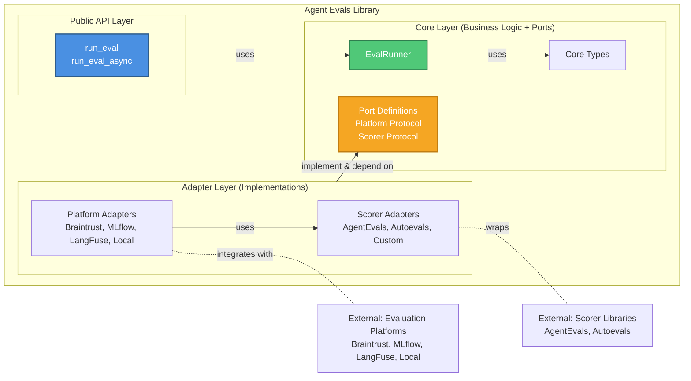
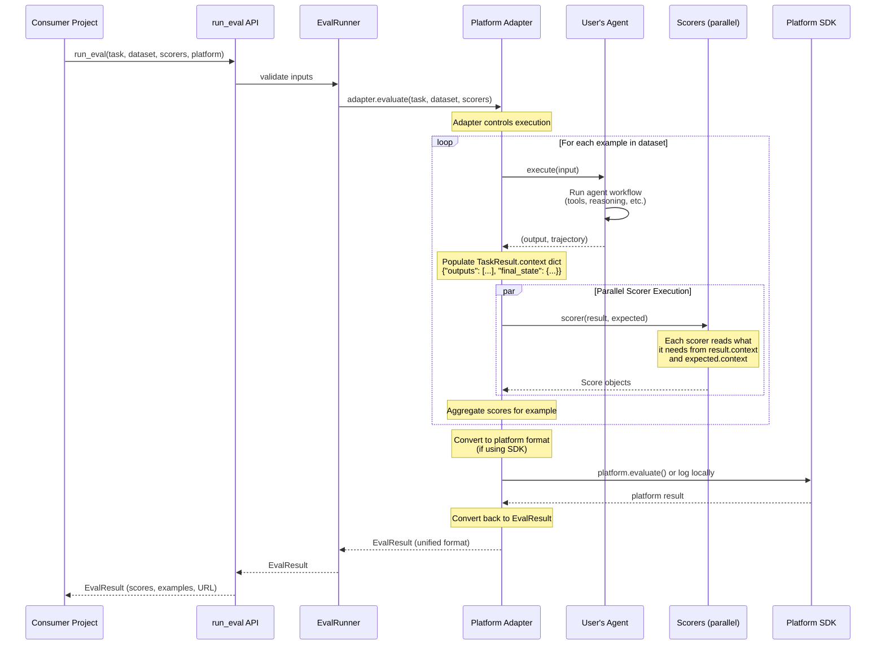
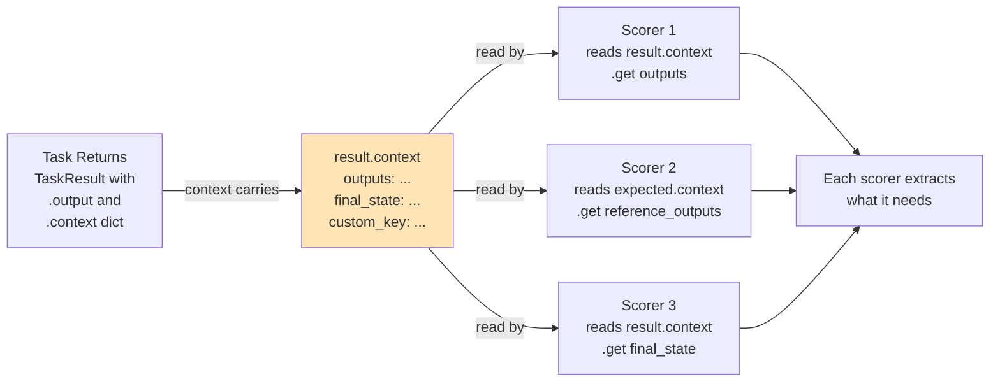
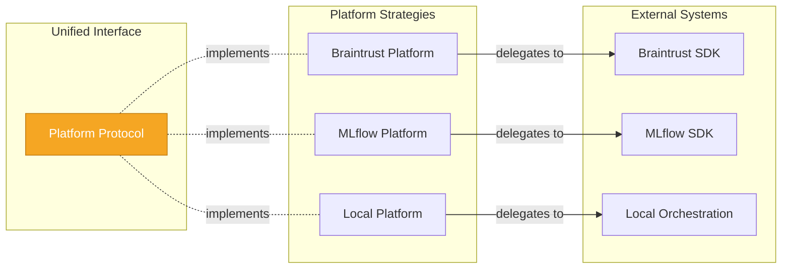
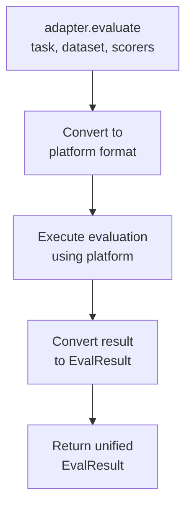
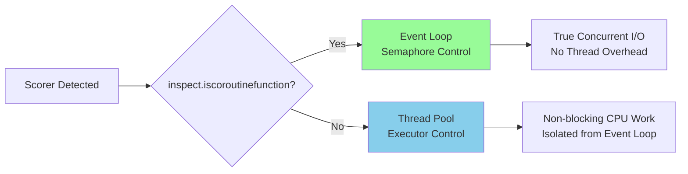

# Agent Evals Library - Architecture Document

- **Purpose:** Design decisions and architectural rationale
- **Audience:** Technical leads, architects, senior engineers
- **Project Type:** Python library (not application)

---

## 📚 Documentation Guide

- **[README.md](https://github.com/boozallen/agent-evals/blob/main/README.md)** - Using the library (start here for users/consumers)
- **[architecture.md](architecture.md)** - Design decisions and rationale (you are here)
- **[CONTRIBUTING.md](https://github.com/boozallen/agent-evals/blob/main/CONTRIBUTING.md)** - Implementation patterns and contribution guide

---

## Table of Contents

1. [Architecture Overview](#architecture-overview)
2. [Core Design Principles](#core-design-principles)
3. [Component Architecture](#component-architecture)

---


## Architecture Overview

### Hexagonal Architecture Overview



This overview shows both component organization and dependency relationships in a single view. For more detailed visualizations with separate layer organization and dependency diagrams, see [System Architecture Diagrams](../diagrams/system-architecture.md).

**Component Relationships:**

- **Solid arrows (→):** "depends on" / "uses" (compile-time dependency)
- **Dotted arrows (-.-):** "implements" or "wraps" (structural relationship)
- **Direction:** All dependencies flow inward (hexagonal architecture principle)

**Component Structure & Dependencies:**

This diagram shows the static architecture - what components exist and how they depend on each other.

**Layers (Inside → Outside):**

1. **Public API Layer:** Entry point for users - `run_eval()` and `run_eval_async()`
2. **Core Layer:** Business logic - defines WHAT evaluation is (domain model, validation rules, coordination)
   - No external dependencies - only depends on Protocol abstractions
   - Contains: EvalRunner, Core Types (Score, EvalResult, ExampleData)
3. **Port Layer:** Protocol interfaces that define contracts - `Platform` and `Scorer` protocols
4. **Adapter Layer:** Two types of adapters (both are hexagonal adapters to external systems)
   - **Platform Adapters:** Connect to evaluation platforms (Braintrust, MLflow, LangFuse, Local)
   - **Scorer Adapters:** Connect to scoring libraries (AgentEvals, Autoevals, Custom)
5. **External Systems:** Third-party platforms and libraries we integrate with

**Dependency Flow (Hexagonal Architecture):**

- Core depends only on Ports (abstractions)
- Adapters depend on Ports (implementing interfaces)
- Adapters depend on External Systems (integration)
- **Key Principle:** Dependencies flow inward - outer layers depend on inner layers, never the reverse

**What This Enables:**

- Swap evaluation platforms without changing core
- Add new adapters without modifying existing code
- Mix scorer libraries from different sources
- Test core independently of external systems

**Key Architectural Insight:**

Both Platform Adapters and Scorer Adapters are hexagonal adapters (secondary/outbound ports):
- **Platform Adapters** connect to external evaluation platforms (orchestration layer)
- **Scorer Adapters** connect to external scoring libraries (computation layer)
- **Relationship:** Platform Adapters use Scorer Adapters (one adapter uses another)

This dual-adapter pattern enables maximum flexibility - swap platforms OR scorers independently.

**For execution flow,** see the "Evaluation Flow" section below.

---

### Evaluation Flow



**Control Flow:**

1. **Consumer calls API:** `run_eval(task, dataset, scorers, platform=BraintrustConfig(project="customer-support-bot", experiment="gpt4-baseline"))`
2. **API → Runner:** Validates dataset and scorers
3. **Runner → Adapter:** Dispatches to platform adapter via Protocol
4. **Adapter orchestrates evaluation:**
   - For each example in dataset:
     - Executes user's task (agent runs, returns a `TaskResult` whose `.context` carries the trajectory/final_state)
     - Runs all scorers in parallel, each called as `scorer(result, expected)`
     - Aggregates scores for the example
5. **Adapter → Platform:** Converts to platform format, calls SDK (Braintrust/MLflow/LangFuse) or executes locally
6. **Platform → Adapter:** Returns platform-specific result
7. **Adapter converts:** Transforms platform result to unified `EvalResult`
8. **Adapter → Runner → API → Consumer:** Returns `EvalResult` with scores, examples, and platform URL

**Note:** This flow applies to both live and historical evaluation modes. For details on how the framework supports both execution patterns through a unified interface, see [Evaluation Modes](../diagrams/evaluation-modes.md).

---

## Core Design Principles

### 1. Protocol-Based Scorer Interface (Duck Typing)

**The scorer contract:**

```python
from collections.abc import Awaitable
from typing import Protocol, Optional
from agent_evals.core.types import Score, TaskResult, ExpectedResult

class Scorer(Protocol):
    """
    Any callable matching this signature is a valid scorer.
    No inheritance required - duck typing via Protocol.

    Scorer-specific data flows through the `context` dict on
    TaskResult (actual) and ExpectedResult (reference), not through
    kwargs. Each scorer reads only the keys it needs; unused keys
    are ignored. This keeps the Protocol signature minimal and
    lets new scorers be added without changing any port.
    """

    def __call__(
        self,
        result: TaskResult,
        expected: ExpectedResult | None = None,
    ) -> Score | Awaitable[Score]:
        ...
```

**How This Design Works:**



**Benefits:**
- ✅ No inheritance required (any callable works)
- ✅ Works with existing libraries (Autoevals) out-of-box
- ✅ Unlimited extensibility (add new `context` keys without breaking the interface)
- ✅ Type-safe with static analysis
- ✅ Scorers only access what they need

**Trade-off:** Less IDE autocomplete for context keys, but we gain backward compatibility and flexibility.

#### Mixed Scorer Pattern

**The Problem:** How do you evaluate BOTH the final output (string) AND the execution path (trajectory) in a single evaluation?

**Our Solution:** String scorers use `expected`, trajectory scorers use `context`, both receive the same signature.

Example: Evaluate both output quality AND execution path:
- Use **Levenshtein** (string scorer) to check final answer accuracy
- Use **TrajectoryStrictMatch** (trajectory scorer) to verify execution path

Dataset provides BOTH types of reference data:
- `input`: The question/task
- `expected`: Reference answer for string scorers
- `output.context.outputs`: Actual trajectory for trajectory scorers
- `output.context.reference_outputs`: Expected trajectory for trajectory scorers

**How it works - each scorer extracts what it needs:**

```python
# String scorer (e.g., Levenshtein)
def string_scorer(result: TaskResult, expected: ExpectedResult | None = None) -> Score:
    # Uses: result.output and expected.expected (the strings)
    # Ignores: context (doesn't need trajectory)
    similarity = calculate_similarity(result.output, expected.expected)
    return Score(name="Levenshtein", value=similarity, passed=True)

# Trajectory scorer (e.g., TrajectoryStrictMatch)
def trajectory_scorer(result: TaskResult, expected: ExpectedResult | None = None) -> Score:
    # Ignores: result.output and expected.expected (doesn't need strings)
    # Uses: result.context["outputs"] and expected.context["reference_outputs"]
    actual_trajectory = (result.context or {}).get("outputs")
    reference_trajectory = (expected.context or {}).get("reference_outputs") if expected else None
    match = compare_trajectories(actual_trajectory, reference_trajectory)
    return Score(name="TrajectoryStrictMatch", value=1.0, passed=match)
```

**Why this is architecturally critical:**

```
ExampleData separates data for different scorer types:
┌─────────────────────────────────────────────────┐
│ input: "..."                                    │
│ expected: "72°F"           ← String ref         │
│ output:                                         │
│    context:                                     │
│       outputs: [trajectory]    ← Actual path    │
│       reference_outputs: [...] ← Expected path  │
└─────────────────────────────────────────────────┘
                 ↓
Both scorers called with same signature:
scorer(output, expected)
                 ↓
         ┌───────┴───────────────────┐
         ↓                           ↓
    Levenshtein               TrajectoryMatch
    Uses: expected            Uses: context
    Ignores: output.context   Ignores: expected
    ✅ No conflict            ✅ No conflict
```

**Alternative approaches and why they fail:**

1. **Put trajectory in `expected` as a nested dict:**
   - ❌ String scorers break: `calculate_similarity(output, {"string": "...", "trajectory": [...]})` fails
   - ❌ Every scorer needs type detection boilerplate
   - ❌ Loss of type safety (`expected: Any`)

2. **Separate `expected_string` and `expected_trajectory` parameters:**
   - ❌ Interface keeps growing with every new data type
   - ❌ Breaks backward compatibility constantly
   - ❌ Not extensible for future use cases

3. **Separate evaluation runs for each scorer type:**
   - ❌ Users must run evaluation twice (inefficient)
   - ❌ Can't combine scores in single report
   - ❌ No unified view of agent performance

**This pattern enables the core value proposition:** "Mix any scorers - Use Autoevals, AgentEvals, and custom scorers together in a single evaluation."

---

### 2. Adapter Pattern for Platform Independence

**Strategy Pattern Design:**



**Interface Contract:**

Platform adapters implement the `Platform` Protocol (see [src/agent_evals/core/ports/platform.py](https://github.com/boozallen/agent-evals/blob/main/src/agent_evals/core/ports/platform.py)):

**Why This Design:**

The pattern enforces consistent structure while enabling flexibility:
- **Consistency:** All adapters follow same conversion → execute → convert pattern
- **Flexibility:** Adapters choose SDK delegation (Braintrust/MLflow/LangFuse) or internal orchestration (Local)
- **Portability:** Unified EvalResult enables platform switching with one parameter

This adapter pattern enables complete independence between platform and scorer choices - any platform works with any scorer combination. See [Adapter Architecture](../diagrams/adapter-architecture.md) for the full independence matrix and usage examples.

**What happens inside `adapter.evaluate()`?**

This section explains how adapters orchestrate evaluation - the details hidden in simplified diagrams above.

**Pattern: Convert → Execute → Convert**



**Adapter Implementation:**

All platform adapters follow the same pattern:

1. **Convert:** Transform our types (ExampleData, Scorer) to what the platform needs
2. **Execute:** Run the evaluation using the platform's capabilities
3. **Convert back:** Transform platform results to unified `EvalResult`

Each adapter chooses how to fulfill this contract - implementation is an adapter detail.

**Key Principle:** Core doesn't know or care how adapters execute - it just dispatches to the protocol and receives a unified `EvalResult`. This enables true platform portability.

**Task-Call Contract:**

Adapters MUST invoke the user task as `task(input_value)`, where `input_value` is the bare `ExampleData.input` from the dataset — *not* a wrapper dict. This is the seam that keeps a single user task body portable across platforms; switching `platform=` is a one-line change at the call site.

Adapters that integrate with SDKs whose native task-call shape differs (langfuse's `task(item={"input": ..., "expected_output": ..., "metadata": ...})` is the historical example) MUST unwrap the SDK shape inside the adapter before calling the user's task. The unwrap belongs in the *concrete* adapter — that's what hexagonal layering is for. See `LangFusePlatform._make_safe_task` for the canonical pattern.

The contract lives on the `Platform` Protocol docstring (`core/ports/platform.py`) as the single source of truth and is mechanically pinned by `tests/validation/test_platform_contract.py`, which runs the same task body against every adapter and asserts each one executes the body successfully against a bare value (proven by output content). If a future adapter author drifts from the contract, that test fires before merge.

**Adapter Testability Pattern (wrapper port + flat fake):**

Every platform adapter SHOULD expose its SDK collaborator through a **module-local Protocol port** plus a thin wrapper class that absorbs the SDK's quirks. Tests substitute a fake implementation of the port via a keyword-only `__init__` parameter on the adapter. The pattern was established for the LangFuse adapter and is the canonical approach for any future adapter testability work.

**Why:** Reaching for `mock.patch("agent_evals.adapters.platforms.<name>.<sdk_symbol>")` in tests is a sign that the adapter has an implicit dependency on a module-level SDK lookup. The fix isn't to add `@patch` more carefully; it's to make the dependency explicit and injectable. See [Cosmic Python ch. 3 — On Coupling and Abstractions](https://www.cosmicpython.com/book/chapter_03_abstractions.html). The wrapper port also future-proofs the adapter against SDK refactors: an SDK rename only changes the wrapper, not every test.

**Structure (two files per adapter family):**

```python
# src/agent_evals/adapters/platforms/<name>_client.py — the SDK seam

from typing import Protocol

class <Name>ClientPort(Protocol):
    """Minimal surface the adapter actually needs from the SDK.

    The port speaks the adapter's domain (returns scalars and dataclasses
    where possible), not the SDK's wire format. The wrapper below absorbs
    the SDK's nesting, attribute traversal, and any module-level state.
    """
    def auth_check(self) -> bool: ...
    # ... other methods named for *operations*, not for SDK calls.

@dataclass
class <DomainRecord>:
    """Flat record extracted from an SDK response. One per nested SDK type."""
    ...

class _Real<Name>Client(<Name>ClientPort):
    """Production wrapper around the real SDK. Absorbs all SDK-shape quirks.

    Explicitly inherits from the Port so a method-signature drift fails
    type-check at this class instead of at every call site.
    """
    def __init__(self, sdk_client) -> None:
        self._sdk = sdk_client

    def auth_check(self) -> bool:
        return self._sdk.auth_check()
    # ... wrapper methods do the SDK-specific traversal/extraction.
```

```python
# src/agent_evals/adapters/platforms/<name>.py — the adapter

from agent_evals.adapters.platforms.<name>_client import (
    <DomainRecord>,
    <Name>ClientPort,
    _Real<Name>Client,
)

class <Name>Platform:
    def __init__(self, *, client: <Name>ClientPort | None = None) -> None:
        self._client = client                    # None = lazy default

    def _get_client(self) -> <Name>ClientPort:
        if self._client is None:
            try:
                sdk_client = <sdk>.get_client()
            except Exception as e:
                # Wrap SDK init failures so all callers see a uniform
                # error surface, not a different exception type per
                # call path.
                raise RuntimeError(
                    "<Name> platform could not obtain an SDK client. "
                    "Check credentials and host environment variables."
                ) from e
            self._client = _Real<Name>Client(sdk_client)
        return self._client

    async def aevaluate(self, ...):
        client = self._get_client()
        # adapter speaks the *port's* methods, not the SDK's
```

**Fake (in `tests/helpers/fake_<name>.py`):**

```python
class Fake<Name>Client:
    """Flat fake. One method per port method. Records calls for assertion."""
    def __init__(self, *, auth_ok=True, ...):
        self._auth_ok = auth_ok
        self.experiments: list[dict] = []        # records run_experiment calls

    def auth_check(self) -> bool: return self._auth_ok
    # ... methods that return seeded values or raise seeded exceptions.
```

Tests construct `<Name>Platform(client=Fake<Name>Client(...))` and assert on the public-API outputs (`EvalResult.examples[*]`), not on private adapter methods.

**Per-adapter, not shared:**

Each adapter has its **own** port (`LangfuseClientPort`, `MlflowSessionPort`, `BraintrustClientPort`). The three SDKs differ enough — Langfuse has a client object, MLflow uses module-level mutation (`set_tracking_uri`/`set_experiment`), Braintrust uses module-level functions (`braintrust.EvalAsync`) — that one shared port would force all three into a shape that fits none of them well. The reusable element is **structure** (port + wrapper + flat fake), not a shared interface.

**What gets wrapped vs. passed through:**

- **Wrap:** *Service-like* SDK objects (clients, sessions, experiments-in-progress) and any nested attribute traversal the adapter performs (e.g., `client.api.trace.get(id).observations[-1].output` becomes `client.get_trace_output(id)`).
- **Pass through:** *Value-like* SDK objects (`ExperimentResult`, `EvalCase`, `Feedback`). The adapter's existing `_convert_from_platform_result` already handles these defensively via `getattr`. SDK-shape drift in value types is supposed to surface in the live integration test (`tests/integration/test_<name>_adapter_live.py`), not be hidden by the wrapper.

**What this pattern intentionally does NOT do:**

- It does not introduce a `core/ports/<name>_client.py`. The port is **module-local** to the adapter — it's an internal seam, not a hexagonal-architecture port like `Platform`. Putting it in `core/ports/` would force `core/` to know that Langfuse exists, violating hex layering.
- It does not collapse all three SDK clients into a single interface. Per-adapter ports stay per-adapter.
- It does not eliminate the live integration test. The wrapper protects against SDK *naming* drift, not *behavioral* drift; the live test is what catches behavior.

**Worked example (two-file shape):** Future adapter PRs follow this layout:

- `src/agent_evals/adapters/platforms/langfuse.py` — the adapter itself (`LangFusePlatform` + its conversion helpers). Imports the port and wrapper from the sibling file.
- `src/agent_evals/adapters/platforms/langfuse_client.py` — the SDK seam (`LangfuseClientPort` Protocol + `_RealLangfuseClient` wrapper + `DatasetItemRecord` dataclass). ~150 LOC of focused, isolated code an onboarding reader can review in one click without scrolling past adapter internals.
- `tests/helpers/fake_langfuse.py` — the flat fake (`FakeLangfuseClient` implementing the port).

The two-file split is **progressive disclosure**: a reader picking up the adapter starts in `langfuse.py` and sees `LangFusePlatform`'s public methods first; they click through to `langfuse_client.py` only when they need to understand what the adapter needs from the SDK. The split was added after an original retrofit had everything colocated.

Future adapter authors should establish their `<name>_client.py` file from the start. The Langfuse adapter went through one retrofit cycle (an earlier "fake-the-SDK" approach was replaced once it became clear the fake had to mirror the SDK's nested `client.api.trace.get(...)` chain to be useful — see the spec's revision note for the full retrospective). Starting from the wrapper-port template skips that round-trip.

**Worked example #2 — Braintrust adapter (single-method port):**

The Braintrust port has *one* method (`run_eval`), not four like Langfuse's. This asymmetry is intentional and the spec captures why: Braintrust's adapter makes exactly one SDK call (`braintrust.EvalAsync`), has no equivalent of Langfuse's nested `client.api.trace.get(id).observations[-1].output` chain to flatten, and has no SDK auth probe (the Braintrust SDK doesn't expose one — auth is environmental). The env-var presence check stays in the adapter as a boundary guard, not a port method, because `os.getenv` is not an SDK collaboration. `EvalCase` construction moves *into* the wrapper so the adapter passes plain dicts; the wrapper speaks SDK types.

`_RealBraintrustClient`'s constructor takes the `braintrust` *module* (not a client instance — Braintrust has no client object), and stores it as `self._sdk` exactly as Langfuse's wrapper stores its SDK client. Wrapper-defensive-path tests pass `SimpleNamespace` stubs.

The lesson for future adapter authors: the *structure* of the pattern (port + wrapper + flat fake) generalizes; the *port surface* tracks the SDK's actual shape. A single-method port is appropriate when the adapter makes a single SDK call. Don't pad the port with methods that don't reflect real SDK collaboration just for symmetry.

**Worked example #3 — MLflow adapter (session-shaped port):**

The MLflow port has *three* methods (`configure` / `evaluate` / `search_traces`), shaped around the SDK's session-scoped, module-mutating idiom. Unlike Langfuse's client-object port or Braintrust's single-method module wrapper, MLflow's adapter ritual is configure-once-then-reuse: every call to `set_tracking_uri` / `set_experiment` mutates process-wide state that subsequent `evaluate` and `search_traces` calls implicitly read. The wrapper collapses that ritual into one `configure(*, tracking_uri, experiment) -> SessionInfo` method that returns both `experiment_id` and the (echoed-back) `tracking_uri`, so the adapter doesn't need a fourth port method around `mlflow.get_tracking_uri()` for URL construction.

Two MLflow-specific design calls worth seeing:

1. **Dual-shape `search_traces` collapses to one port method.** The SDK's `search_traces(return_type="pandas")` (used for filter-friendly experiment-scoped lookups) and `search_traces(return_type="list")` (used for run-scoped `Trace`-object attribute traversal) are absorbed behind one port method returning `list[TraceRecord]`. The wrapper picks `return_type` based on whether `run_id` is set; the adapter speaks one shape.

2. **`@mlflow.genai.scorer` decoration moves into the wrapper.** The adapter passes `list[ScorerSpec(name, fn)]` to `evaluate`; the wrapper applies `scorer(name=spec.name)(spec.fn)` before calling `mlflow.genai.evaluate`. After the refactor, the adapter no longer imports any `mlflow.*` SDK symbol — same architectural move made for Braintrust's `EvalCase` construction.

The lesson: when the SDK's idiom is module-level state mutation rather than client objects or stateless module functions, "session" is the right port name and the configure-once-then-reuse shape is the right abstraction. The pattern's *structure* (port + wrapper + flat fake) generalizes; the *port surface* tracks the SDK's actual shape.

---

### 3. Error Handling Strategy

**Consistent Error Score Convention:**

When a scorer fails (exception, timeout, missing data), the framework automatically creates an "Error Score":

```python
# Automatic error handling in runner
try:
    score = scorer(result, expected)
except Exception as e:
    # Create error score automatically
    score = Score(
        name=scorer_name,
        value=0.0,
        passed=False,
        metadata={"error": str(e)},
        reasoning="Scorer failed due to exception"
    )
```

**Why This Design:**
- ✅ Evaluations complete even if some scorers fail
- ✅ Errors are first-class data (stored in Score.metadata["error"])
- ✅ Users can distinguish "scored low" from "scorer failed"
- ✅ Aggregate scores reflect only successful scorers
- ✅ Transparent error reporting in results

**Error Detection:**

```python
# Check if a scorer failed
if "error" in score.metadata:
    print(f"Scorer failed: {score.metadata['error']}")
else:
    print(f"Scorer succeeded: {score.value}")
```

---

### 4. Async/Sync Execution Model

**Design Decision: Three-Tier Execution Strategy**

The framework uses different execution strategies based on scorer characteristics, optimizing for performance while maintaining simplicity:

| Scorer Type | Execution Strategy | Rationale |
|-------------|-------------------|-----------|
| **Native Async I/O** | Event loop with semaphore | LLM API calls benefit from true concurrent I/O without thread overhead |
| **Sync CPU-bound** | Thread pool with executor | Fast local operations (string comparison) avoid blocking event loop |
| **Sync I/O-bound** | Thread pool with executor | Legacy libraries without async support run non-blocking |

**Current Distribution:**
- **14 Native Async:** All LLM-based scorers (Factuality, ClosedQA, TrajectoryLLMAsJudge, etc.)
- **11 Sync CPU-bound:** Heuristic scorers (Levenshtein, NumericDiff, trajectory matchers, etc.)

**Why This Architecture:**



**Key Design Trade-offs:**

| Approach | Pros | Cons | Our Choice |
|----------|------|------|------------|
| **All sync in thread pool** | Simple, uniform | Thread overhead for I/O, slower LLM calls | ❌ Not chosen |
| **All async (force async wrappers)** | Maximum concurrency | CPU-bound work clogs event loop | ❌ Not chosen |
| **Dual strategy (our approach)** | Optimal for each type, 66% faster | Slightly more complex | ✅ **Chosen** |

**Single Concurrency Control:**

`EvalConfig.max_concurrent_tests` caps how many test cases (dataset
examples) run at once. One knob, one mental model. Defaults to 1 (serial)
because the framework cannot detect whether your agent mutates shared
state.

Rate-limiting LLM calls is the agent/scorer's responsibility — the
framework doesn't babysit downstream API usage.

```python
EvalConfig(max_concurrent_tests=5)  # 5 tests in flight at once
```

### 5. Why There Is No Converter Protocol

**Design Decision: Framework-output converters are plain free functions, not ports.**

Platform adapters and scorer adapters are Protocols (`Platform`, `Scorer`) because the runner resolves them at runtime by name (via platform/scorer registries). The Protocol defines the call shape the runner can rely on; the registry is the dispatch point.

Framework-output converters have neither property. Users call `langchain_to_openai(...)` directly at import time. No code resolves a converter from a string at runtime. There is no dispatch point to protect.

An earlier iteration of this library defined an `AgentOutputConverter` Protocol with a three-argument `convert(messages, final_state, output) -> TaskResult` method, a converter registry, and four `from_<framework>` wrapper functions. A later revision removed that scaffolding because:

- **Every concrete converter ended with the same two lines** (`build_task_result(openai_messages, final_state, output)`). The "framework-specific" port was 80% framework-agnostic boilerplate. The wrapper belonged in the core type (`TaskResult.from_messages`), not in a Protocol.
- **Only `messages` actually varied per framework.** `final_state` was a pure pass-through to `context["final_state"]`; `output` was either the universal last-assistant-text default or a per-framework override that belongs at the call site. A Protocol signature that advertises variation it doesn't actually exhibit is dishonest.
- **`final_state` is not special.** It's just one of many possible `context` keys scorers might read (`StateMatch` reads it; `TrajectoryLLMAsJudge` doesn't; a custom `DBStateMatch` would read `context["db_state"]`). Promoting it to a named converter parameter privileged one scorer's vocabulary above all others for no structural reason.
- **No runtime dispatch, no Protocol.** CLAUDE.md's rule "Use `typing.Protocol`, not `ABC`" exists to govern ports. Without a dispatch point there is no port, and inventing one is scaffolding.

**The resulting shape:**

- `core/types.py` defines `TaskResult.from_messages(openai_messages, **context) -> TaskResult` — the one library convention for wrapping normalized messages (messages land at `context["outputs"]`, output defaults to last assistant text). `**context` is the uniform extensibility slot: `final_state=`, `reference_outputs=`, or anything a custom scorer reads.
- `adapters/converters/<framework>.py` each export a single free function `<framework>_to_openai(messages) -> list[dict]`. One job per function, named after the job. Converters no longer import `TaskResult` at all — they are pure `list[dict]` transformers, making adapter-independence contracts strictly easier to satisfy.
- Non-default `output` cases (e.g., `mink-sdk` where `output=chat["response"]`) use the plain `TaskResult(...)` constructor. No framework-specific magic in any shared helper.

**What this means for contributors:** adding a new framework's converter is one function, not a class + decorator + Protocol conformance + registry entry + wrapper. See `docs/converters.md` for the updated template.

---

### 6. Success-Check DTOs at the Composition Root

**Design Decision: Per-scenario "what success means" is a closed DTO union dispatched at the composition root; scorers stay unaware of dispatch.**

The benchmark layer used to ask each capability "which scorers run?" and each scenario "what reference data do you carry?" — two questions wired together by implicit field-name correlations (`expected_state` field on a scenario implied `StateMatch` ran on that capability). That coupling forced capability-wide scorer uniformity. If scenario A is best-checked by end-state assertions and scenario B by trajectory checks, the user had to either run every scorer on every scenario (and tolerate false-fail cells where the scorer had no reference data) or split the capability in two (polluting the diagnostic vector with a measurement-choice axis instead of a product-surface axis).

The right shape collapses both questions into one declaration *per scenario*: "here is what success looks like." Each entry in the scenario's `success:` block names a registered success-checker type, with that type's YAML payload. `core/checks.py` defines the `CheckSpec` union (currently `StateCheck | ToolUseCheck`); parser classes in `adapters/success_checkers/` Pydantic-validate YAML payloads and produce `CheckSpec` instances via `to_spec()`; `_composition.compile_check(spec)` returns a `CompiledCheck` carrying the scorer + expected_context + scorer_config triple.

Scorers themselves stay untouched. They don't learn about checkers, dispatch, or applicability — the runner never asks a scorer "should you run on this scenario?" because dispatch happens before the scorer is called. `Score` gains no `applicable` field, no tri-state. The benchmark loader walks `scenario.success.items()`, resolves each entry's parser class via the success-checker registry (`registry.get(name)(**payload)`), calls `.to_spec()`, then passes the spec to `compile_check` to get the scorer. Scenarios with identical scorer-sets group together; the runner makes one `run_eval_async` call per group and merges results so each scorer's denominator counts only the scenarios that declared the matching success checker. Markdown reports become truthful by construction.

**Why scorers don't own dispatch.** Scorers are pure measurement code: given a result and a reference, return a `Score`. Asking them "do I apply here?" leaks the configuration question into the measurement question. Two pieces of code with two responsibilities, kept separate.

**Why a DTO union and not a Protocol.** Check types are part of the library's domain vocabulary, not a third-party plugin point. Closing extension via union → `match` → `assert_never` exhaustiveness gives a stronger guarantee than a Protocol contract: forgetting to update a `case` arm fails type-checking, not runtime. Adding a new check type is one DTO declaration + one parser + one `case` arm; `ty` enforces the third. The audit confirmed zero external custom-checker implementations across all sister repos.

**Why no cross-family edge.** The parser→spec layer doesn't import scorers — it produces data. Scorer construction lives at the composition root (`_composition.compile_check`), where the bootstrap layer is allowed to depend on adapters per Contract 1. `import-linter` Contract 2 (`Adapter Family Independence`) has zero whitelist exceptions; every adapter family is mechanically peer-isolated.

**The registry as the single seam.** `agent_evals.core._registries` exports a `success_checker_registry` instance (an `AdapterRegistry[type]`). Concrete parser modules decorate their classes with `@success_checker_registry.register("name")`. The benchmark loader resolves a parser by `cls = registry.get(key); instance = cls(**payload)`, then calls `instance.to_spec()`. The composition root (`_composition.py`) re-exports the default registry; consumers either accept the default or inject a fresh `_SuccessCheckerRegistry()` instance for tests. Nothing in `core/` or `benchmark/` imports concrete parser classes by module path.

**Why `success:` lives on the scenario, not the capability.** A capability is a product-surface grouping (`lights`, `weather`, `multi-step planning`). The choice of how to measure success for a particular scenario is a measurement-method axis that's orthogonal to the product-surface grouping. Forcing them to share an axis (the old capability-wide `scorers:` list) was the original bug. Letting each scenario declare its own success, with the loader grouping by shared scorer-sets after the fact, restores the orthogonality.

**What this means for contributors:** adding a new success check type is:
1. Declare a new frozen dataclass in `core/checks.py`
2. Extend the `CheckSpec` union
3. Add a `case` arm in `_composition.compile_check`
4. Write a Pydantic parser in `adapters/success_checkers/<name>.py` decorated with `@success_checker_registry.register("yaml_key")`
5. Add eager import + `__all__` entry in `adapters/success_checkers/__init__.py`

Test: parametric coverage in `tests/unit/test_compile_check.py`, parser contract tests in `tests/unit/adapters/success_checkers/test_<name>.py`.

**`ToolUseCheckParser` dispatches to five scorer factories** (via `compile_check`). The `match_calls` field selects between `ToolCallExactMatch` (`exact`), `ToolCallSupersetMatch` (`superset`), `ToolCallSubsetMatch` (`subset`), `ToolCallUnorderedMatch` (`unordered`), and `ToolCallAnyMatch` (`any_of`). All five are native to this codebase (under `adapters/scorers/tool_calls.py`), agentevals-free, and operate on tool-call frames only — chosen over agentevals wrappers so YAML references list expected tool calls without padding for tool-response or prose frames. The dispatch lives in `compile_check`; the registry layer doesn't see the per-mode branching.

**`match_args` direction is uniform across all five list-level modes.** `subset = actual ⊆ reference`, `superset = reference ⊆ actual`, `exact = equality`, `ignore = no comparison`. The list axis (`match_calls`) and args axis (`match_args`) compose orthogonally — the same args-mode word means the same containment regardless of which list-level mode is dispatched.

---

### 7. Per-Scenario Preconditions

**Design Decision: Per-scenario "what state to seed before the run" is a Protocol port with a registry; the Pydantic class IS the applier (no spec/mechanism split).**

The benchmark scores final state. For that score to mean "the model did the right thing," the world must start in a state where the assertion can fail. Hand-picking prompts that always transition *away* from the agent's defaults excludes whole classes of useful tests (idempotency, "turn off X when X is already on," multi-tool with non-default starting context). The fix is a per-scenario `precondition:` block, parallel to `success:`, that declares scenario-specific state to seed *before* the agent runs.

The shape collapses to one declaration per scenario: each entry under `precondition:` names a registered precondition type, with that type's YAML payload. The benchmark loader walks `scenario.precondition.items()`, resolves each through the precondition registry (`cls = registry.get(name); applier = cls(**payload)`), and hands the resulting list to the agent at run time as `preconditions=...` on `run_case`. The agent calls `applier.apply(target)` on each before consuming the prompt.

**Why ONE Protocol (not two like the old success side).** The success side's earlier design split `SuccessChecker` (spec) → `to_scorer()` → `Scorer` (mechanism) because scorers were reused across checkers. The current design uses a DTO union instead — `CheckSpec` in `core/checks.py` captures the spec as data, and `_composition.compile_check` constructs the scorer at the composition root. Preconditions were never in this situation: each precondition shape (`state`, future `cookies`, `db_seed`, `corpus`) has a 1:1 relationship with its applier. A separate "spec" Protocol whose only method is `to_applier()` would be a factory layer with no composition behind it — speculative architecture. So preconditions get **one port, `PreconditionApplier`, where the Pydantic class IS the applier**: Pydantic validates the payload at construction; `apply(target)` performs the side effect.

**Why no cross-family edge.** Preconditions don't compose anything: they hold a payload and mutate a target. So `adapters/preconditions/` has *no* cross-family edges. Both directions (`preconditions → others` and `others → preconditions`) are forbidden by import-linter contracts. The family is fully peer-isolated, exactly like `platforms/`, `scorers/`, `success_checkers/`, and `converters/` are from each other.

**Why preconditions are silent in the report.** Preconditions are *inputs*, not outputs. A failed precondition application (the agent's `apply()` raises) surfaces as a per-scenario error in the existing `EvalResult` plumbing — no new metrics, no new columns. The markdown report doesn't need to know about the field.

**Known design tradeoff (deferred): agent-layer dispatch.** The agent receives `preconditions: list[PreconditionApplier]` and calls `applier.apply(target)` on each — choosing `target` itself. For the v1 home-automation domain, every applier wants the agent's state dict, so the agent passes that one surface unconditionally. When a second applier shape lands (e.g., `CookiePreconditionApplier` wanting browser cookies), the agent will dispatch on applier type to pick the right surface — an OCP smell at the agent boundary. Two ways to address it when it becomes a real problem: (1) per-applier `surface_key: ClassVar[str]` and the framework calls `applier.apply(surfaces[applier.surface_key])`; (2) appliers receive a richer object (the agent itself, or a structured surfaces map) and pick what they need. Both are deferred; the v1 hardcoded-target choice is YAGNI-clean today and explicitly documented as a known limit, not an oversight.

**The registry as the single seam.** `agent_evals.core._registries` exports a `precondition_registry` instance (an `AdapterRegistry[type[PreconditionApplier]]`). Concrete applier modules decorate their classes with `@precondition_registry.register("name")`. Resolution is `cls = registry.get(name); applier = cls(**payload)` — the same shape success checkers use. See "Adapter Registry Injection" below.

**What this means for contributors:** adding a new precondition type is one Pydantic model (with an `apply(target)` method) + one decorator + one re-export. No runner change, no scorer change, no schema migration — just a new key in YAML and a new entry in the registry. The `@precondition_registry.register(...)` decorator enforces the method at decoration time; missing it fails fast at import.

---

### 8. Benchmark Config Readers

**Design Decision: Multi-file benchmark composition + pluggable storage are one Protocol port with a registry; URI scheme is the dispatch key.**

A single benchmark YAML file does not scale. As scenario counts grow, users want to group scenarios by capability into separate files — 100+ scenarios in one file is not editable, not reviewable, and not diffable. The mechanism that delivers this is a load-time URI-resolution pass: list entries in the parent YAML may be strings like `file://capabilities/lights.yaml`, which the loader resolves to file content before handing the merged dict to `BenchmarkConfig.model_validate`.

The dispatch key is the URI **scheme** (the part before `://`). `file` resolves to a local-filesystem reader; future `s3` would resolve to an S3 reader; `https` to an HTTPS reader. Same YAML surface across local and remote backends; same registry pattern as platforms, scorers, success checkers, and preconditions.

**Why a Protocol (and not a free function).** The benchmark loader resolves reader names from URI schemes at runtime via the reader registry — that's the dispatch point a Protocol exists to govern. The same justification underpins `Platform`, `Scorer`, and `PreconditionApplier`. Converters by contrast had no such dispatch and remained free functions. Same library, same rule applied consistently.

**Why ONE Protocol (no spec/mechanism split).** Each scheme has a 1:1 relationship with its reader. There is no analog to the success side's "many checkers compose the same scorer" — readers don't compose anything. A separate factory layer would have no composition behind it. The Pydantic-class-IS-the-applier pattern from preconditions applies again here: the reader IS the thing the registry resolves; calling `read(uri)` returns the bytes.

**Why no glob/`list()` method on the port (YAGNI).** An earlier draft included `list(uri) -> list[str]` for glob expansion (`file://capabilities/*.yaml`). Removed because (a) capabilities are added rarely enough that listing 5–10 files explicitly is not a real burden, and (b) `list()` was the source of cross-backend semantic ambiguity (S3 prefix vs POSIX glob; HTTPS has no listing convention; zero-match policy; sort-order guarantees). Adding `list()` later is additive-safe — Protocols can grow methods, and an existing reader without `list()` could be given a default returning `[uri]`. If the "drop a file in, auto-included" UX ever becomes load-bearing, that's the time to design the cross-backend contract.

**Why "ConfigReader" (and not "Source", "Storage", "Loader").** SRP: results, prompts, and benchmark configs are different things with different reasons to change — they don't share a port. This port has one job: given a URI, return the bytes of a benchmark config (or part of one). Read-only, scoped to benchmark composition. "Reader" is the verb-form name that says exactly what it does. If results-writing ever needs a port, it becomes `BenchmarkResultWriter` — parallel structure, no overloaded vocabulary. "Source" was rejected as too vague (everything has a source); "Storage" overlapped with results-storage; "Loader" collided with `benchmark/loader.py` which composes capabilities at a different layer.

**Why no cross-family edge.** Like `preconditions/`, readers don't compose anything — they hold no state, take a URI, return bytes. So `adapters/benchmark_config_readers/` has *no* cross-family edges. Both directions (`benchmark_config_readers → others` and `others → benchmark_config_readers`) are forbidden by import-linter contracts. The family is fully peer-isolated, exactly like `preconditions/`.

**Resolution before validation.** The loader resolves URIs *before* calling `BenchmarkConfig.model_validate`. The model never sees URI strings as list entries. This keeps `extra="forbid"` honest and ensures Pydantic validation errors point at structural mistakes, not URI ambiguity.

**The registry as the single seam.** `agent_evals.core._registries` exports a `config_reader_registry` instance (an `AdapterRegistry[type[BenchmarkConfigReader]]`). Concrete reader modules decorate their classes with `@config_reader_registry.register("scheme")`. Resolution is `reader = registry.get(scheme)(); reader.read(uri)` — readers take no constructor args. See "Adapter Registry Injection" below.

**What this means for contributors:** adding a new reader (e.g., for `s3://`, `gs://`, `https://`) is one class with a `read(uri)` method + one decorator + one re-export. No runner change, no schema migration. The `@config_reader_registry.register(...)` decorator enforces the method at decoration time; missing it fails fast at import.

---

### 9. Adapter Registry Injection

Each adapter family owns a registry that maps string keys (from YAML, from public-API arguments, from user code) to a registered callable. All five families implement the same `AdapterRegistry[T]` Protocol from `core/ports/registry.py`:

```python
class AdapterRegistry(Protocol[T]):
    def get(self, key: str) -> T: ...
    def list(self) -> list[str]: ...
    def __contains__(self, key: str) -> bool: ...
```

The Protocol is *read-only*. Registration is the family's concern (each registry class also exposes a `register(name)` decorator method, but `register` is not part of the Protocol — Protocol consumers only read).

`get(key)` returns the registered callable. The caller invokes it with the family's specific construction shape: scorers call factories with kwargs (`factory(expected_state={"x": 1})`); success-checkers and preconditions call classes with payload dicts (`cls(**payload)`); config-readers and platforms call classes with no args. The differing shapes belong at the call site, not in the Protocol — uniform shape there would force one family to accommodate the union of all construction patterns.

**Module-level instances.** All five `_<Family>Registry` classes and their default `<family>_registry` instances live together in `core/_registries.py` (a single underscore-prefixed core-private module). Concrete adapter modules decorate against the family's instance:

```python
# adapters/scorers/state.py
from agent_evals.core._registries import scorer_registry

@scorer_registry.register("StateMatch")
def StateMatch(expected_state=None):
    ...
```

`_composition.py` is the single source of runtime wiring for all 5 registries. Each public API entry point (`run_eval`, `run_eval_async`, `run_benchmark_async`) is defined here and resolves its registries through 4 lazy-getter helpers (`_get_<family>_registry()`). Benchmark-layer functions accept registries as required kwargs; the composition root is the only production caller that wires defaults, so the public surface itself takes no registry kwargs.

**Why this is not a Singleton.** The `<family>_registry` pattern looks superficially like the GoF Singleton pattern, but differs in three load-bearing ways:

| | Singleton pattern | This codebase |
|---|---|---|
| Constructor | Private; `__new__` enforces one instance | Public; `_<Family>Registry()` is callable any time |
| Number of instances | Exactly one, ever | Any number; default + N test instances |
| How callers get it | Reach into `Registry.get_instance()` | Receive as injected parameter |

Tests construct fresh `_<Family>Registry()` instances and pass them via the registry-injection parameter; the default is never mutated. Production code reaches the defaults from two places: `_composition.py` (via its `_get_<family>_registry()` lazy-getter helpers, for all 5 registries) and the family's `__init__.py` PEP 562 loader (for public-API re-exports). Both are accepted by the `Benchmark uses public surface only` contract's `ignore_imports` whitelist; the contract still forbids any other path into the registry modules.

**Adding a new adapter family.** Follow the pattern established by the five existing families:

1. Define a port Protocol in `core/ports/<family>.py`.
2. Add a `_<Family>Registry` class implementing `AdapterRegistry[T]` and a module-level `<family>_registry` instance to `core/_registries.py` (alongside the other five families). Use the shared `_same_registered(a, b)` helper from `core/ports/registry.py` for the duplicate-registration check (it handles module reload via module+qualname comparison).
3. Concrete adapters in `adapters/<family>/<adapter>.py` decorate against `<family>_registry.register("name")` (imported from `agent_evals.core._registries`).
4. The benchmark layer (or wherever needs the dispatch) accepts `<family>_registry: AdapterRegistry[T]` as a required keyword parameter; production callers wire the default through `_composition.py`, and tests inject fresh instances directly.
5. Add a `_get_<family>_registry()` lazy-getter helper to `_composition.py` and have every public API entry point in `_composition.py` resolve the registry through it. Step 6 (`_LAZY` entry in `agent_evals/__init__.py`) covers the public-API exposure of the registry default itself.
6. Add a loader function (`_load_<family>_registry`) and `_LAZY` entry in `agent_evals/__init__.py`.
7. Add the new family to the `Benchmark uses public surface only` `ignore_imports` whitelist in `.importlinter` if its registration triggers a benchmark→adapters edge.
8. `import-linter`'s `Adapter Family Independence` contract enforces no cross-family edges automatically.

The registry pattern is the single shape every new family follows. Don't ship `register_X` / `parse_X` / `list_X` free functions — they were tried (in earlier versions of the four older families) and ended up drifted across families. The Protocol-injection pattern collapses them into one shape.

**Lazy-load via PEP 562 (platforms only).** `adapters/platforms/` uses PEP 562 lazy-load to tolerate uninstalled optional dependencies (`braintrust`, `mlflow`, `langfuse`); the `_PlatformRegistry` triggers the lookup via `getattr(agent_evals.adapters.platforms, key)` on cache miss. All other families (`scorers`, `success_checkers`, `preconditions`, `benchmark_config_readers`) eagerly import their concrete classes from `__init__.py` — they have no optional dependencies and their import graph is clean.

### 10. Endpoint Transport Validation in `core/`

Every caller-supplied endpoint this library resolves itself is checked before anything connects to it. `core/transport.py` holds the whole rule: `is_secure_endpoint_value(value)` as a pure predicate, and `validate_secure_transport(field_name, value)` raising `ValueError` with an actionable message.

**Why `core/`, not a shared adapter helper.** The call sites are split across `adapters/platforms/` and `adapters/scorers/`, which the `Adapter Family Independence` contract forbids from importing each other. A helper in either family would be unreachable from the other, so the only home that both can import is downward into `core/`. That is not a workaround — the function is a pure string predicate over a value type with no I/O, which is exactly what `core/` is for.

**The rule is an allowlist, not a denylist.** Accepted: encrypted schemes (`https`, `wss`); non-network schemes that transmit nothing (`file`, `sqlite`); local filesystem paths, including Windows drive and UNC paths; a non-network sentinel (`databricks`); an unset value, where the setting's own required-ness applies; and cleartext `http` / `ws` when — and only when — the host is loopback. Everything else is rejected, so an unrecognised scheme fails rather than being assumed safe.

Two properties are load-bearing and easy to break by accident:

- **No I/O, ever.** Loopback is decided from the value — the name `localhost` or an address literal in `127.0.0.0/8` or `::1` — and never resolved. A resolved answer could stop being true between the check and the connection, and a `core/` predicate that opens a socket is no longer a predicate. Host comparison is equality, never a prefix or suffix test.
- **No opt-out.** No environment variable, argument, or configuration key relaxes the check. The loopback allowance is a property of the value rather than a switch, so it is decided identically on every machine and never admits cleartext to another host. A process-wide bypass would disable validation for every other endpoint in the process, which is a worse outcome than the rule it would relax.

**Which values are validated, and which are not.** A value this library resolves and passes itself is validated. A collaborator the caller constructs and injects (`session=`, `client=`) is not — its transport was resolved by the caller, not here, so it is not this library's to police. `core/transport.py` names no adapter, platform, or optional dependency, per the `core/` prose rule.

**The Open/Closed guard.** `tests/validation/test_transport_enforcement.py` enumerates `scorer_registry`, selects every factory that declares an endpoint parameter by signature inspection, and asserts each one rejects a cleartext remote value. A new endpoint-accepting scorer factory therefore fails the build until it validates, rather than silently shipping unvalidated. The guard carries a non-vacuity floor so an empty registry cannot pass by examining nothing, and it cannot see a factory whose parameter is named differently — `adapters/scorers/agentevals.py` is covered by its own tests for that reason.

**Posture logging.** `adapters/platforms/transport_posture.py` records one `INFO` line per socket-opening platform-adapter construction, on the constructing adapter's own logger and naming that adapter in the message body, so an operator can confirm from a log scan that validation was in force. Both halves of that are load-bearing: `INFO` because a production log configuration typically discards `DEBUG`, and the platform name because a run that builds two adapters would otherwise emit records that differ only in the logger name, which many format strings drop. It is deliberately not called per scorer construction: a benchmark run builds dozens of scorers, and one record each would bury the statement worth reading.

---

## Component Architecture

### Library Structure

```
src/agent_evals/               # Package root (importable) - Composition Root
│
├── __init__.py                # Public API + Composition Root (wires adapters)
│
├── core/                      # Business logic (platform/adapter agnostic)
│   ├── __init__.py            # Core exports
│   ├── _registries.py         # All five _<Family>Registry classes + default <family>_registry instances
│   ├── runner.py              # Async + sync runner (validates inputs, dispatches)
│   ├── types.py               # Core domain types (TaskResult, Score, EvalResult, ExampleData, EvalConfig, PlatformConfig)
│   ├── transport.py           # validate_secure_transport / is_secure_endpoint_value (pure endpoint allowlist, no I/O)
│   │
│   └── ports/                 # Port Definitions (Protocols)
│       ├── __init__.py        # Re-exports Platform, Scorer, PreconditionApplier, BenchmarkConfigReader
│       ├── platform.py        # Platform Protocol
│       ├── scorer.py          # Scorer Protocol (callable scoring interface)
│       ├── precondition_applier.py  # PreconditionApplier Protocol (per-scenario state seeding)
│       └── benchmark_config_reader.py  # BenchmarkConfigReader Protocol (URI-dispatched config fetching)
│
├── adapters/                  # Framework- and platform-facing translation
│   │
│   ├── platforms/             # Platform adapters (concrete adapter modules; dispatch lives in core/_registries.py)
│   │   ├── braintrust.py
│   │   ├── mlflow.py
│   │   ├── langfuse.py
│   │   ├── local.py
│   │   └── transport_posture.py  # log_transport_posture(logger, platform) — one INFO line per network-adapter construction
│   │
│   ├── scorers/               # Scorer adapters (concrete adapter modules; dispatch lives in core/_registries.py)
│   │   ├── agentevals.py      # AgentEvals trajectory scorers
│   │   ├── autoevals.py       # Autoevals string scorers
│   │   ├── state.py           # StateMatch native scorer
│   │   └── tool_calls.py      # Native tool-call scorer family (Exact/Superset/Subset/Unordered/Any)
│   │
│   ├── success_checkers/      # Success-check parsers (produce CheckSpec DTOs; dispatch lives in _composition.compile_check)
│   │   ├── __init__.py        # Re-exports StateCheckParser, ToolUseCheckParser for IDE discoverability
│   │   ├── end_state.py       # StateCheckParser (produces StateCheck DTO)
│   │   └── tool_use.py        # ToolUseCheckParser (produces ToolUseCheck DTO)
│   │
│   ├── preconditions/         # Precondition-applier adapters (concrete adapter modules; dispatch lives in core/_registries.py)
│   │   ├── __init__.py        # Re-exports concrete appliers
│   │   └── state.py           # StatePreconditionApplier (deep-merge with dotted-path expansion)
│   │
│   ├── benchmark_config_readers/  # Benchmark-config-reader adapters (concrete adapter modules; dispatch lives in core/_registries.py)
│   │   ├── __init__.py            # Re-exports concrete readers
│   │   └── local_file.py          # LocalFileConfigReader (file://abs/path; UTF-8 read)
│   │
│   └── converters/            # Framework message normalizers (free functions — no Protocol)
│       ├── langchain.py       # langchain_to_openai(messages) -> list[dict]
│       ├── strands.py         # strands_to_openai(messages) -> list[dict]
│       └── mink.py            # mink_to_openai(tool_history) -> list[dict]
│
└── benchmark/                 # Application layer: YAML-driven multi-capability runner
    ├── __init__.py            # Public API (run_benchmark_async, ...)
    ├── agent.py               # BaseAgent template class (feature-private; only benchmark uses it)
    ├── config.py              # Pydantic YAML schema (BenchmarkConfig, ScenarioSpec, ...)
    ├── loader.py              # load_benchmark() + compile_capability() (returns per-scorer-set groups)
    ├── runner.py              # BenchmarkRunner, run_benchmark_async, _merge_eval_results
    ├── artifacts.py           # _write_report (pure I/O primitive; public form is BenchmarkResult.write_report)
    ├── report.py              # build_markdown_report (pure renderer)
    └── types.py               # BenchmarkResult (macro-average aggregation, to_markdown)
```

**Dependency Rules (enforced by import-linter contracts in `.importlinter`):**
- ✅ `adapters/` can import from `core/` (including `core/ports/`)
- ❌ `core/` NEVER imports from `adapters/` (hex-layers contract)
- ❌ Adapter families — `platforms/`, `scorers/`, `converters/`, `success_checkers/`, `preconditions/`, `benchmark_config_readers/` — are independent (`Adapter Family Independence` contract). Runtime composition happens at the `core`/`benchmark` layer, not via cross-family imports. All families are strictly peer-isolated with zero whitelist exceptions; success-check scorer construction lives at the composition root via `compile_check` (`_composition.py`), not as a direct import between adapter families. See the relevant principle sections above for the rationale; the import-linter config enforces this automatically for any new family added under `adapters/`.
- ✅ Composition Root (`__init__.py` + `_composition.py`) wires adapter registries to core at runtime — registries are passed by injection, not pulled from globals
- ✅ `benchmark/` (application layer) imports through the package root and accepts `AdapterRegistry[T]` instances. It may import Protocol types from `core.ports` (per DIP — the application depends on abstractions, not concretions), but never from `core.runner`, `_composition`, or a specific adapter module (`Benchmark uses public surface only` contract; the simplified contract uses an explicit `ignore_imports` whitelist for the registry-default re-exports rather than `allow_indirect_imports`)

**Scorer Registry (`scorer_registry` in `core/_registries.py`):**

Mirrors the platform registry — both are concrete classes (`_ScorerRegistry`, `_PlatformRegistry`) implementing `AdapterRegistry[T]` and colocated in `core/_registries.py`. Every built-in scorer factory (`StateMatch`, all 18 autoevals, all 7 agentevals) is decorated with `@scorer_registry.register("FactoryName")` — the same identifier is used as the Python symbol *and* as the name surfaced in `EvalResult.pass_rates` keys / report columns. Benchmark YAML reaches scorers indirectly through the success-checker registry and the composition root: each `success:` key resolves to a `CheckSpec` DTO via parser `to_spec()`, and `_composition.compile_check` maps the spec to the concrete scorer. Application-layer callers (the benchmark loader, user Python code) resolve scorer names through `scorer_registry.get(name)(**kwargs)` rather than importing specific scorer modules, preserving the layering boundary.

**Success-Checker Registry (`success_checker_registry` in `core/_registries.py`):**

Stores parser classes, not scorer-bearing Protocol instances. Every built-in parser (`StateCheckParser`, `ToolUseCheckParser`) is decorated with `@success_checker_registry.register("yaml_key")`; the benchmark loader resolves YAML `success:` keys through `cls = registry.get(key); parser = cls(**payload); spec = parser.to_spec()`. The composition root (`_composition.compile_check`) maps the `CheckSpec` DTO to the concrete scorer. Parsers are eagerly imported from `success_checkers/__init__.py` — no lazy-load needed because parsers don't import scorers (the import graph is clean).

**Benchmark Layer (`benchmark/`):**

A thin application layer above adapters. `run_benchmark_async(yaml, agent=...)` parses a YAML file, then for each capability compiles its scenarios into a list of `(dataset, scorers)` groups (one per distinct scorer-set declared by the capability's scenarios via their `success:` blocks). Capabilities run sequentially; groups within a capability also run sequentially, preserving the user-visible "≤`n_parallel_runs` LLM calls in flight" cap. The runner makes one `run_eval_async` call per group and merges the per-group `EvalResult` objects via `_merge_eval_results` so each scorer's denominator counts only the scenarios that declared the matching success checker. The benchmark layer is async-only; scripts wrap the entry-point call in `asyncio.run(...)` (no `run_benchmark` sync wrapper exists).

The benchmark layer accepts `AdapterRegistry[T]` instances (one per family — scorer, success-checker, precondition, config-reader) as required keyword parameters. Production callers wire the defaults through `_composition.py`'s `_get_<family>_registry()` lazy-getter helpers; tests inject fresh instances directly. See "Adapter Registry Injection" below.

**Why This Structure?**
- Clear separation of concerns
- Easy to add new adapters or scorers
- Core remains testable without external dependencies
- Package structure reflects architectural boundaries

**What is "Business Logic" in Our Core?**

The Core Layer contains the business logic of evaluation - the fundamental rules of WHAT an evaluation IS, independent of WHERE or HOW it runs:

**Domain Model:**
- What is a `Score`? (name, value, passed, metadata, reasoning)
- What is an `EvalResult`? (collection of examples with scores)
- What is valid input data? (ExampleData validation)

**Evaluation Rules:**
- Validate dataset and scorers before execution
- Build context for trajectory evaluation
- Dispatch to appropriate platform adapter
- No knowledge of Braintrust, MLflow, AgentEvals, or Autoevals

**Pure Coordination:**
- Core validates and dispatches
- Core does NOT execute tasks or scorers
- Core does NOT log to platforms
- Core depends only on abstractions (Protocols in `core/ports/`)

This separation enables swapping adapters without changing the fundamental evaluation logic.

**Composition Root Pattern:**
- Top-level `__init__.py` (delegating heavy wiring to `_composition.py`) serves as the Composition Root
- `_composition.py` injects `platform_registry` into `core/runner.py`'s internal entry points and wires the 3 benchmark registries into `load_benchmark` from inside `run_benchmark_async`. Tests bypass the composition root via the `default_benchmark_registries` fixture.
- Core never imports adapters directly — registries are injected as parameters
- Enables strict dependency inversion (enforced by import-linter; see "Adapter Registry Injection" below)

**Adapter Architecture:**

Both adapter types live under `adapters/` with separate subfolders:
- **Platform Adapters** (`adapters/platforms/`) connect to external evaluation platforms
- **Scorer Adapters** (`adapters/scorers/`) connect to external scoring libraries
- **Relationship:** Platform adapters USE scorer adapters during evaluation

This dual-adapter pattern follows strict hexagonal architecture with dependency inversion enforced by import-linter.

**Note:** Adapters control execution strategy. Some may use utilities from `utils/orchestration.py`, others may delegate to platform SDKs. Implementation is adapter-specific.

**Extensibility:** The adapter architecture enables third-party extensions without core modifications. For details on custom platform and scorer integration, see [Adapter Architecture](../diagrams/adapter-architecture.md).

---

### Core Type Definitions

**Design Decision: Pydantic v2 for Runtime Type Safety**

All core types (`ExampleData`, `Score`, `EvalExample`, `EvalResult`) are implemented as Pydantic BaseModel classes instead of dataclasses or plain dicts.

**Why Pydantic?**

| Approach | Type Safety | Validation | Extensibility | Simplicity |
|----------|-------------|------------|---------------|------------|
| **Plain Dicts** | ❌ None | ❌ None | ✅ Very flexible | ✅ Simple |
| **Dataclasses** | ✅ Static only | ❌ Manual | ⚠️ Limited | ✅ Simple |
| **Pydantic** | ✅ Static + Runtime | ✅ Automatic | ✅ Flexible | ⚠️ More complex |

**Key Benefits:**
- ✅ **Runtime validation** catches malformed data immediately (e.g., score > 1.0, unknown keys)
- ✅ **Clear error messages** guide users to fix issues (e.g., "outputs must be in context")
- ✅ **Schema enforcement** prevents common mistakes (typos, wrong nesting)
- ✅ **Immutability** for Score objects prevents accidental modification
- ✅ **Built-in serialization** (`model_dump()`) for platform adapters

**Trade-offs:**
- ❌ Additional dependency (Pydantic v2)
- ❌ Slightly more verbose than dataclasses
- ❌ Learning curve for contributors unfamiliar with Pydantic

**Architectural Impact:**

This decision enables:
1. **Explicit Context Pattern**: `extra="forbid"` enforces that trajectory data goes in `context`, not top-level
2. **Fail-Fast Validation**: Bad data is caught at dataset creation, not during evaluation
3. **Type-Safe Scorers**: Scorers receive validated Score objects, not arbitrary dicts
4. **Platform Portability**: Consistent serialization across all adapters

**See [src/agent_evals/core/types.py](https://github.com/boozallen/agent-evals/blob/main/src/agent_evals/core/types.py) for implementation details.**
